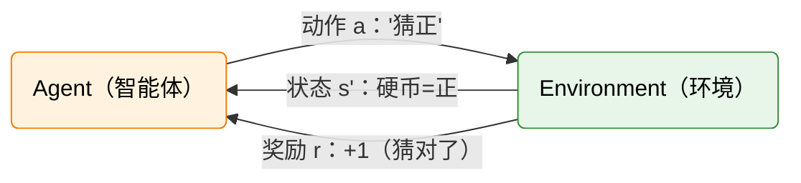

# 3.1 动手：玩一个简化 MDP 游戏——猜硬币正反面

在第 1 章的 CartPole 和第 2 章的 DPO 中，环境、状态、动作、奖励这些词已经反复出现。但在那些实验里，它们都被库封装在了黑盒里——Gymnasium 负责环境，TRL 负责训练，你只需要调几个参数就能跑通。我们亲眼看到了结果（木棍立起来了，模型学会了礼貌），却不清楚中间到底发生了什么。

现在，让我们亲手搭建一个最简单的 RL 环境，把每一步都暴露在阳光下。

这个环境只有一个状态、两个动作、一个奖励规则：猜硬币正反面。别小看它——这个"玩具"浓缩了 RL 的全部核心要素。就像物理学家用单摆理解经典力学一样，我们用猜硬币来理解强化学习。

## 构建环境：一个只有两行的 MDP

规则非常简单：硬币被抛出，你可以猜"正"或"反"，猜对 +1 分，猜错 -1 分。

你可能会想："这不就是抛硬币嘛，有什么好学的？"没错——对于一枚公平硬币，无论你怎么猜，长期期望回报都是 0。猜正面也好，猜反面也好，甚至抛一枚自己的硬币来决定猜什么也好，结果都一样。50% 的概率赢 1 分，50% 的概率输 1 分，长期来看就是不赚不亏。环境本身没有任何可以被利用的规律，就像一个赌场里的公平轮盘——庄家不需要担心赌客赢钱，因为数学站在庄家这一边。

但当硬币有偏的时候，事情就变得有趣了。想象一枚被做了手脚的硬币，正面朝上的概率是 60%——不是 50%，而是 60%。这个微小的偏度改变了整个游戏的性质：一个聪明的策略应该能"发现"这枚硬币的偏度，然后调整自己的猜法，始终猜正面，从而在长期中赢多输少。这正是 RL 要做的事情——从与环境的交互中发现规律，并利用这些规律来最大化收益。

先别急，让我们用代码把这个环境搭起来，亲手跑一遍。

## 用 Python 实现猜硬币环境

```python
import random

class CoinFlipEnv:
    """一个最简 MDP：猜硬币正反面"""

    def __init__(self, bias=0.5):
        """
        Args:
            bias: 硬币正面的概率，0.5 为公平硬币
        """
        self.bias = bias
        self.coin_face = None  # 当前硬币面（对智能体不可见）

    def reset(self):
        """抛一枚新硬币，返回观察结果"""
        self.coin_face = "正" if random.random() < self.bias else "反"
        return self.coin_face  # 简化：假设你能看到硬币面

    def step(self, guess):
        """
        智能体猜正/反，返回 (奖励, 是否结束, 信息)
        """
        reward = 1 if guess == self.coin_face else -1
        done = True  # 每轮只猜一次
        info = {"coin": self.coin_face, "guess": guess}
        return reward, done, info
```

这段代码非常短，但请注意它的结构——它严格遵循了 Gymnasium 的接口规范。`reset()` 重置环境并返回初始状态，就像每局游戏开始前洗牌一样。`step()` 接收智能体的动作，返回这一步的奖励、游戏是否结束、以及一些额外信息。这和 CartPole 的接口完全一致——只不过 CartPole 有 4 维连续状态和 2 个动作，而这里只有 2 个离散状态和 2 个动作。麻雀虽小，五脏俱全。

你可能已经注意到了一个细节：在我们的实现中，`reset()` 返回了硬币的面——也就是说智能体能"看到"硬币是正还是反。在更严格的 RL 设定中，状态不一定完全可观察（这就是 POMDP——部分可观察 MDP，本书不深入讨论）。但为了简化起见，我们假设智能体能完全看到状态。

另一个值得注意的地方是 `done = True`。这意味着每一轮只有一步——你猜一次，得到奖励，游戏就结束了。下一轮是一局全新的游戏。这和 CartPole 不同：CartPole 的每一局包含很多步，杆子倒下才算结束。猜硬币的每一局只有一步，是最简单的"单步决策"MDP。后面的章节中，我们会把这个游戏扩展为多轮连续决策的版本。

## 用随机策略跑 100 轮

环境搭好了，现在需要一个策略来玩它。先写一个最笨的策略——随机猜，看看结果如何：

```python
# ==========================================
# 随机策略：每轮等概率猜正或反
# ==========================================
env = CoinFlipEnv(bias=0.5)  # 公平硬币
total_reward = 0
num_episodes = 100

for ep in range(num_episodes):
    state = env.reset()        # 抛硬币
    guess = random.choice(["正", "反"])  # 随机猜
    reward, done, info = env.step(guess)
    total_reward += reward

print(f"随机策略跑 {num_episodes} 轮的总回报: {total_reward}")
print(f"平均每轮回报: {total_reward / num_episodes:.2f}")
```

你会看到类似这样的输出：

```
随机策略跑 100 轮的总回报: -4
平均每轮回报: -0.04
```

总回报在 0 附近波动。多跑几次，你会发现有时候是 +6，有时候是 -8，但基本都在 0 附近晃悠。这不难理解：对于公平硬币，猜对和猜错的概率各占一半，长期平均回报趋近于：

$$\mathbb{E}[R] = 0.5 \times (+1) + 0.5 \times (-1) = 0$$

这里我们第一次遇到了一个非常重要的概念——**期望回报**。它就是"所有可能结果的概率加权平均"。0.5 的概率赢 1 分，0.5 的概率输 1 分，加起来就是 0。这个 0 不是某一次的具体得分，而是"如果你玩无数次的平均得分"。就像掷骰子的期望值是 3.5——你永远掷不出 3.5，但大量实验的平均会趋近于 3.5。

公平硬币的环境本身没有可以利用的规律，所以再聪明的策略也只能拿 0。这其实揭示了一个更深层的原则：策略的好坏是相对于环境而言的。不存在"绝对好"的策略——如果一个环境没有任何可利用的结构，所有策略的表现都一样。

但等等——如果硬币不是公平的呢？

## 偏硬币：让"聪明策略"有了意义

让我们把硬币改为正面概率 60%（`bias=0.6`），然后写一个"永远猜正"的策略：

```python
# ==========================================
# 固定策略：永远猜正
# ==========================================
env_biased = CoinFlipEnv(bias=0.6)
total_reward = 0
num_episodes = 100

for ep in range(num_episodes):
    state = env_biased.reset()
    guess = "正"  # 永远猜正
    reward, done, info = env_biased.step(guess)
    total_reward += reward

print(f"偏硬币（60%正），永远猜正，跑 {num_episodes} 轮的总回报: {total_reward}")
print(f"平均每轮回报: {total_reward / num_episodes:.2f}")
```

输出变成了：

```
偏硬币（60%正），永远猜正，跑 100 轮的总回报: 22
平均每轮回报: 0.22
```

平均回报从 0 变成了正数。直觉上很好理解：正面占 60%，永远猜正面就能赢多输少。60 次猜对赢 60 分，40 次猜错输 40 分，净赚 20 分，摊到 100 轮就是 0.20。

这个 0.22 的数字背后隐藏着一个简洁的数学关系。用期望回报来精确计算：

$$\text{期望回报} = P(\text{猜对}) \times (+1) + P(\text{猜错}) \times (-1) = 0.6 \times 1 + 0.4 \times (-1) = 0.2$$

100 轮的平均值 0.22 和理论值 0.2 的微小差异，只是因为样本量还不够大——跑 10000 轮会更接近 0.2。这就是统计学中的**大数定律**：样本越多，平均值越接近期望值。如果你有耐心跑一百万轮，平均值会非常精确地落在 0.2 上。

现在让我们对比一下：同样是"永远猜正"这个策略，在公平硬币上期望回报是 0，在 60% 偏硬币上是 0.2。策略完全没变，只是环境变了。这说明了一个关键的洞察——策略的好坏取决于环境。一个在某种环境下表现优秀的策略，换到另一种环境下可能完全不行。反过来，如果你不知道环境是什么样的，你也可以通过尝试不同的策略来"推断"环境的特性——这正是 RL 学习的核心思想。

如果硬币偏度变成 90%（`bias=0.9`），"永远猜正"的平均回报就变成了 $0.9 \times 1 + 0.1 \times (-1) = 0.8$。偏度越大，"永远猜占优面"的策略回报越高。硬币越偏，可利用的结构越明显，策略的收益也越大。

## Agent-Environment 交互循环

现在让我们退后一步，看看刚才的代码里到底发生了什么。

每轮游戏开始时，环境抛一枚硬币（`reset()`），得到一个状态——"正面"或"反面"。然后智能体做出决策——"猜正"或"猜反"（`step()`）。环境根据猜测是否正确给出奖励——猜对 +1，猜错 -1。这个循环不断重复，智能体的目标就是让累积奖励尽可能大。

不管环境是猜硬币、CartPole 还是大模型对话，RL 的交互循环都是同一个模式。在猜硬币中，状态是"正/反"，动作是"猜正/猜反"，奖励是 ±1。在 CartPole 中，状态是 4 个物理量（位置、速度、角度、角速度），动作是"左推/右推"，奖励是每步 +1。在 DPO 对齐大模型时，状态是"已生成的文本"，动作是"下一个 token"，奖励是"人类偏好打分"。表面上千差万别，底层的交互模式完全一样。



这个循环有一个名字——**Agent-Environment Loop**。它是 RL 最基础的概念模型。智能体（Agent）是决策者，它观察环境的状态（State），根据某种策略（Policy）选择一个动作（Action）。环境（Environment）接收到动作后，转移到新的状态，并给出一个奖励信号（Reward）。智能体的目标是找到一个策略，使得在整个交互过程中获得的累积奖励最大。

值得注意的是，智能体和环境之间有一条清晰的界线。智能体能控制的是自己的动作——猜正还是猜反。智能体不能直接控制的是环境的转移——硬币是正还是反。智能体只能通过动作间接地影响自己的收益。这种"我能控制什么、我不能控制什么"的区分，是 RL 问题建模的核心。

## 3.2 从游戏到概念

运行完上面的代码后，让我们停下来想一想：这个简单的游戏里，已经包含了 RL 的哪些核心要素？

**第一个观察：策略的"好坏"取决于环境。** 公平硬币下，所有策略一样烂；偏硬币下，"永远猜正"比随机猜好。这说明策略不是绝对的好或坏，而是相对于环境而言的。一个好的策略需要看清环境结构，然后选择能最大化累积奖励的行动。在真实世界中，这种"环境结构"可能是物理定律（CartPole 的力学方程）、市场规律（量化交易的价格模式）、或者人类偏好（什么样的回答更受欢迎）。RL 的本质，就是让智能体通过与环境的交互来发现这些结构。

**第二个观察：期望回报是衡量策略好坏的标尺。** 我们用 $\mathbb{E}[R] = 0.6 \times (+1) + 0.4 \times (-1) = 0.2$ 来衡量"永远猜正"在偏硬币上的表现。这个计算虽然简单，但它包含了一个重要的思想：我们在乎的不是某一次的得分，而是**长期平均**的得分。就像一个投资者不会因为一天的涨跌而欣喜若狂或万念俱灰——他在乎的是长期的期望收益。RL 也是一样：我们追求的是策略在大量交互后的平均表现，而不是某一次的运气。

**第三个观察：未来奖励要打折。** 上面的例子每轮只猜一次，所以没有涉及到"未来"。但在 CartPole 中，智能体需要关心整个时间线上的累积奖励——它不仅要活过这一步，还要尽可能多活几步。如果我们定义折扣累积回报为：

$$G_t = r_t + \gamma r_{t+1} + \gamma^2 r_{t+2} + \cdots = \sum_{k=0}^{\infty} \gamma^k r_{t+k}$$

其中 $\gamma$（gamma）是折扣因子，取值在 0 到 1 之间。$\gamma$ 接近 0 意味着智能体只关心眼前的即时奖励，像一个"今朝有酒今朝醉"的人。$\gamma$ 接近 1 意味着它很有远见，像一个精打细算的投资者。当 $\gamma = 0.9$ 时，10 步后的奖励只值当前奖励的 $0.9^{10} \approx 0.35$ 倍——也就是说，10 步后的 1 分，在现在看来只值 0.35 分。

为什么不直接让 $\gamma = 1$？因为在无限期游戏中，如果 CartPole 永远活下去，总奖励会趋于无穷大——数学上就发散了。折扣因子让累积奖励收敛到一个有限值，同时也符合人类直觉：今天的 100 块比明年的 100 块更有价值。如果你不信，想象一下：朋友说"今天还你 100 块"和"明年还你 100 块"，你选哪个？

在 LLM 对齐中，$\gamma$ 的含义略有不同——我们通常只关心整个回答的质量，不太涉及时间步的概念。但在 PPO 的训练中，$\gamma$ 仍然用于计算优势函数，第 6 章会详细展开。

**第四个观察：探索与利用的矛盾已经出现。** 在偏硬币的例子中，我们默认选择了"永远猜正"这个策略。但在真实场景中，智能体事先并不知道硬币的偏度——它需要通过试探来发现。是坚持自己当前的猜法（利用），还是偶尔试试另一种猜法以获取更多信息（探索）？这就是 RL 中著名的"探索-利用困境"（Exploration-Exploitation Dilemma）。在猜硬币中这个困境很温和——偏度是固定的，试探几轮就能发现。但在更复杂的环境中（比如下围棋或控制机器人），探索和利用的平衡是一个核心的研究问题。

有了这些直观体验，接下来让我们把"状态、动作、奖励"这些概念提炼成一个精确的数学框架——[MDP 形式化与价值函数](./formalism)。
