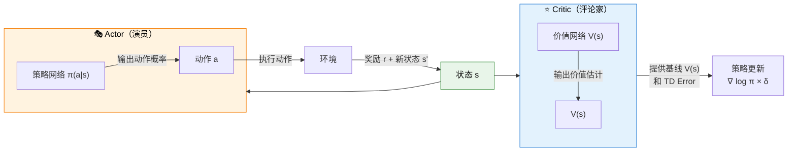

# 4.5 从 REINFORCE 到 Actor-Critic：价值函数是降方差的钥匙

在上一节中，我们看到了 REINFORCE 的核心公式：

$$\nabla_\theta J \approx \nabla_\theta \log \pi_\theta(a_t|s_t) \cdot G_t$$

这个公式能用，但有一个致命问题：$G_t$ 的**方差太大**。同一个动作，运气好的时候 $G_t$ 很大，运气差的时候 $G_t$ 很小。这让训练像"醉汉走路"。

怎么降方差？答案就藏在我们第 3 章学过的概念里——**价值函数**。

## 第一步：引入基线（Baseline）

一个直接的想法：与其用 $G_t$ 的绝对值，不如用**相对值**——"这个结果比平均水平好多少"。

$$\nabla_\theta J \approx \nabla_\theta \log \pi_\theta(a_t|s_t) \cdot (G_t - b(s_t))$$

其中 $b(s_t)$ 就是**基线**——"状态 $s_t$ 下的平均回报"。

| 符号           | 含义（大白话）                                         |
| -------------- | ------------------------------------------------------ |
| $G_t$          | 实际拿到的回报（"这趟跑了多少分"）                     |
| $b(s_t)$       | 基线——这个状态下的"平均期望"（"正常情况下能跑多少分"） |
| $G_t - b(s_t)$ | 实际 vs 平均的差距（"比平时好了还是差了"）             |

**为什么加基线能降方差？** 因为基线减掉了"运气"带来的波动——如果某个状态本身就能拿高分（$b$ 大），那即使你运气好拿到 $G_t = 10$，相对于基线也只有 $10 - 8 = 2$ 的"真正贡献"，不会被误认为是"特别好的动作"。

数学上可以证明：只要 $b(s_t)$ 不依赖于动作 $a$，引入基线**不会改变梯度的期望**（即仍然是正确的梯度方向），但能**显著降低方差**。

## 第二步：用什么做基线？——价值函数 V(s)

最好的基线是什么？**第 3 章学的状态价值函数 $V(s)$**。

为什么？因为 $V^\pi(s)$ 的定义就是"从状态 $s$ 出发，遵循策略 $\pi$，期望能拿多少分"——这不正是"平均期望"的精确含义吗？

把基线替换为 $V(s)$：

$$\nabla_\theta J \approx \nabla_\theta \log \pi_\theta(a_t|s_t) \cdot (G_t - V(s_t))$$

这里的 $G_t - V(s_t)$ 有一个名字——**优势函数**（Advantage Function）$A(s, a)$：

$$A(s, a) = G_t - V(s) = \text{"做了动作 a 比平均水平好了多少"}$$

> 严格来说，优势函数的定义是 $A^\pi(s,a) = Q^\pi(s,a) - V^\pi(s)$，这里用 $G_t$ 近似 $Q(s,a)$ 是蒙特卡洛估计。

## 第三步：用 TD Error 替代 G_t——从 MC 到 TD

还有一步优化。$G_t$ 需要跑完整个 episode 才能计算。还记得第 3 章的 TD Error 吗？

$$\delta = r + \gamma V(s') - V(s)$$

TD Error 只依赖**一步转移**（当前状态、动作、奖励、下一状态），不需要等到 episode 结束。而且，TD Error 本身就是优势函数的一种估计：

$$A(s,a) \approx \delta = r + \gamma V(s') - V(s)$$

| 对比                      | REINFORCE              | Actor-Critic                 |
| ------------------------- | ---------------------- | ---------------------------- |
| **动作评估**              | 用 $G_t$（实际回报）   | 用 $\delta$（TD Error）      |
| **需要跑完 episode 吗？** | 需要                   | 不需要（走一步就能更新）     |
| **方差**                  | 高（整条轨迹的随机性） | 低（只有一步的随机性）       |
| **偏差**                  | 无偏                   | 有偏差（用估计值更新估计值） |

## 4.6 Actor-Critic 架构详解

把上面三步整合起来，就得到了 RL 中最重要的架构之一——**Actor-Critic**，由 Richard Sutton 等人在 2000 年系统化 [^2]：

### 两个网络，各司其职

| 网络                 | 角色     | 输入     | 输出                 | 学习目标         |
| -------------------- | -------- | -------- | -------------------- | ---------------- |
| **Actor（演员）**    | 选择动作 | 状态 $s$ | 动作概率 $\pi(a\|s)$ | 最大化累积奖励   |
| **Critic（评论家）** | 评估局面 | 状态 $s$ | 价值估计 $V(s)$      | 准确预测未来回报 |

### 优势函数：Actor 和 Critic 的桥梁

$$A(s, a) = r + \gamma V(s') - V(s)$$

| 符号               | 含义（大白话）                                             |
| ------------------ | ---------------------------------------------------------- |
| $A(s, a)$          | 优势——"做了动作 $a$，比平均水平好了多少"                   |
| $r + \gamma V(s')$ | 实际经历的结果（即时奖励 + 下一状态的价值）= **TD Target** |
| $V(s)$             | Critic 对当前状态的评估 = **基线**                         |
| $A > 0$            | 这个动作比平均好 → Actor 应该**增加**这个动作的概率        |
| $A < 0$            | 这个动作比平均差 → Actor 应该**降低**这个动作的概率        |

### Actor-Critic 的更新流程

| 步骤 | 操作                                                                                    | 谁在做           |
| ---- | --------------------------------------------------------------------------------------- | ---------------- | ----- |
| 1    | Actor 观察状态 $s$，按策略 $\pi(a                                                       | s)$ 选择动作 $a$ | Actor |
| 2    | 环境返回奖励 $r$ 和新状态 $s'$                                                          | 环境             |
| 3    | Critic 评估 $V(s)$ 和 $V(s')$，计算 TD Error $\delta = r + \gamma V(s') - V(s)$         | Critic           |
| 4    | 用 TD Error 更新 Critic：$V(s) \leftarrow V(s) + \alpha_V \cdot \delta$                 | Critic           |
| 5    | 用优势更新 Actor：$\theta \leftarrow \theta + \alpha*\pi \cdot \nabla*\theta \log \pi(a | s) \cdot \delta$ | Actor |

### Critic 和第 3 章的关系

如果你仔细看 Critic 的更新规则，你会发现它就是**第 3 章的 TD Learning**：

$$V(s) \leftarrow V(s) + \alpha \cdot \delta$$

其中 $\delta = r + \gamma V(s') - V(s)$ 就是 TD Error。

**Critic 网络本质上就是第 3 章价值函数 $V(s)$ 的神经网络实现。** 而 Actor 网络就是策略 $\pi(a|s)$ 的神经网络实现。两个函数逼近器（第 3 章 3.6 节的概念）协同工作——Critic 帮 Actor 判断"这个动作比平均好多少"，Actor 根据判断调整自己的策略。

### 为什么比 REINFORCE 好？

|              | REINFORCE               | Actor-Critic                |
| ------------ | ----------------------- | --------------------------- |
| **动作评估** | $G_t$（整条轨迹的回报） | $\delta$（一步的 TD Error） |
| **方差**     | 高                      | 低                          |
| **更新时机** | episode 结束后          | 每走一步                    |
| **偏差**     | 无偏                    | 有偏（自举）                |
| **类比**     | 跑完马拉松再看总分      | 每跑一公里就调整配速        |

Actor-Critic 用 Critic 提供的 $V(s)$ 做基线，用 TD Error 做优势估计，**在保持正确梯度方向的同时大幅降低了方差**。这就是它成为现代 RL 骨架架构的原因。

### 后续章节：Actor-Critic 的演进

| 章节         | Actor-Critic 的变体 | 关键改进                                         |
| ------------ | ------------------- | ------------------------------------------------ |
| 第 6 章 PPO  | **PPO-Clip**        | 限制策略更新幅度，防止步子迈太大                 |
| 第 6 章 GAE  | **广义优势估计**    | 多步 TD Error 的指数加权和，进一步平衡偏差和方差 |
| 第 8 章 GRPO | **去掉 Critic**     | 用组内均值替代 $V(s)$，省掉一个网络              |

<strong>思考题：Actor-Critic 比 REINFORCE 好，为什么不用纯 Critic（只用 V）？</strong>

因为**只有 Critic 没有办法直接输出策略**。Critic 学的是 $V(s)$ 或 $Q(s,a)$，从中推导策略需要用 $\arg\max_a Q(s,a)$——但在连续动作空间中，这个 $\arg\max$ 不存在解析解（你不可能对无限多个连续值逐一比较）。

Actor 的价值在于：**它直接输出动作概率，天然适用于连续动作空间**。这就是为什么需要两个网络——Critic 负责"评价"，Actor 负责"选择"，缺一不可。

<strong>思考题：Actor-Critic 的"偏差"从哪来？它有害吗？</strong>

偏差来自 Critic 的**自举**（Bootstrapping）——Critic 用自己的估计 $V(s')$ 来更新 $V(s)$。如果 $V(s')$ 本身就不准确，那误差会传播回来。

这种偏差在数学上**不一定是坏事**——适度的偏差可以换取更低的方差，整体上可能比无偏但高方差的 REINFORCE 收敛更快。第 6 章的 GAE 就是在精确控制"偏差-方差权衡"。

**你将理解**：

- 基线（Baseline）通过减掉"平均期望"来降低方差——不改变梯度方向
- 最好的基线是价值函数 $V(s)$，优势函数 $A(s,a) = G_t - V(s)$
- Actor-Critic = Actor（策略网络）+ Critic（价值网络），用 TD Error 作为桥梁
- Critic 本质上就是第 3 章价值函数 $V(s)$ 的神经网络实现
- Actor-Critic 是后续 PPO、GAE、GRPO 的骨架架构

现在让我们回到代码，用实验验证基线的效果——[基线实验与总结](./baseline-experiment)。

---

[^2]: Sutton, R. S., et al. (2000). Policy gradient methods for reinforcement learning with function approximation. _Advances in Neural Information Processing Systems_, 12.
