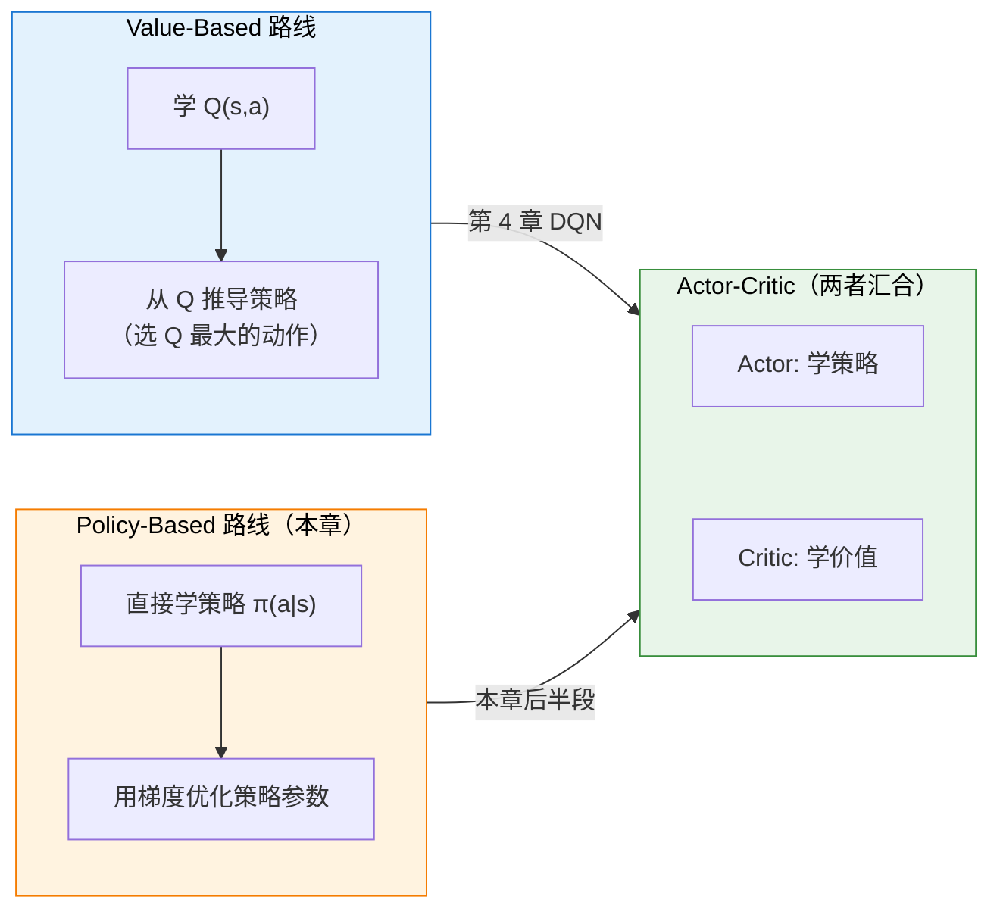
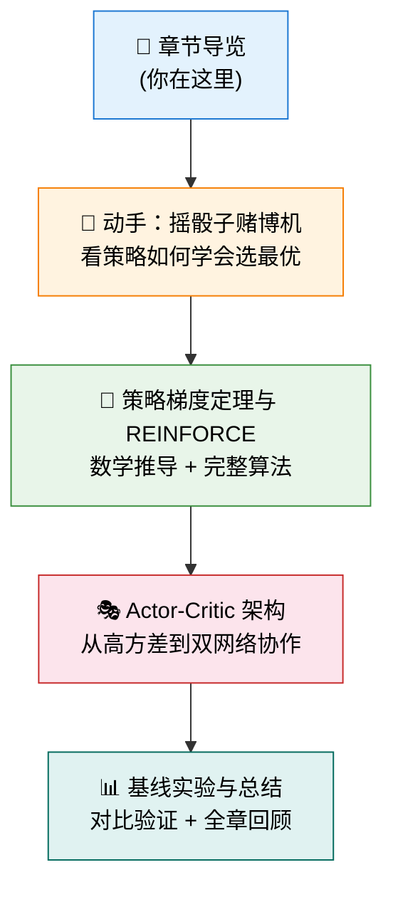

# 第 5 章：策略梯度与 Actor-Critic——从摇骰子到双网络协作

> **本章目标**：理解"如何用梯度下降直接优化策略"这一核心思想。这是 PPO、GRPO 等现代算法的共同理论基础。
>
> **本章地位**：上一章我们走完了 RL 的理论地基（MDP、价值函数、贝尔曼方程），并且站在高处看到了两条路线——Value-Based 和 Policy-Based。本章正式踏上 **Policy-Based 路线**，你将亲手写代码让一个策略网络从"什么都不知道"进化到"学会选最优动作"。

## 核心问题：为什么不先学价值，直接学策略？

在第 3 章的末尾，我们看到了 RL 的两条路线：

**Value-Based**（第 4 章的 DQN）的思路是：先学会"每个动作值多少分"（Q 值），然后选分数最高的动作。这很直觉，但在大模型场景下不太好用——因为词表有 5 万多个 token，你不可能对每个 token 都精确算出 Q 值。

**Policy-Based**（本章的 REINFORCE）的思路截然不同：**跳过 Q 值，直接学习"在什么情况下选什么动作"的策略函数 $\pi(a|s)$**。就像你学骑自行车——你不需要先计算出"左转 15 度值 0.87 分"，而是直接练出一套"感觉这样骑更稳"的直觉。

**最终两条路线在 Actor-Critic 架构中汇合**——Actor 学策略，Critic 学价值，两个网络互相配合。这个双网络结构就是第 6-8 章所有算法（PPO、DPO、GRPO）的骨架。

## 本章暗线：高方差 → 基线 → Actor-Critic

本章有一个贯穿始终的"暗线"——**策略梯度的致命伤是高方差**，所有后续改进都围绕"怎么降方差"展开：

1. REINFORCE 用实际回报 $G_t$ 来更新策略 → **方差巨大**，训练像"醉汉走路"
2. 引入**基线（Baseline）**减掉"运气"带来的噪声 → 方差降低
3. 用第 3 章的**价值函数** $V(s)$ 做基线 → 自然引出 **Critic 网络**
4. Actor + Critic = **Actor-Critic 架构** → 第 6 章 PPO 的骨架

## 章节路线图

| 小节                                    | 核心问题                                  | 你将获得                           |
| --------------------------------------- | ----------------------------------------- | ---------------------------------- |
| [摇骰子赌博机](./dice-game)             | 策略网络怎么学会"偏爱好的动作"？          | 亲眼看到梯度更新改变策略概率       |
| [策略梯度定理](./policy-gradient)       | "好结果 → 强化动作概率"的数学本质是什么？ | 掌握策略梯度的核心公式和 REINFORCE |
| [Actor-Critic 架构](./actor-critic)     | 怎么解决高方差？价值函数能帮什么忙？      | 理解双网络架构——后续所有算法的骨架 |
| [基线实验与总结](./baseline-experiment) | 加上基线效果有多好？                      | 直观理解方差和基线，完成全章闭环   |

准备好了吗？让我们从一个简单的赌博游戏开始——[摇骰子赌博机](./dice-game)。
