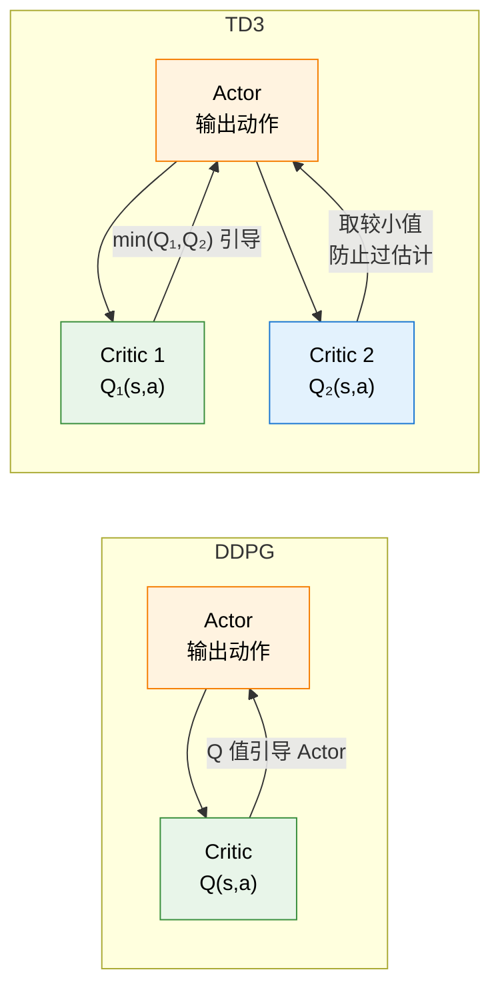

# 11.2 连续策略与 DDPG/TD3

上一节我们在 PyBullet 里操控了机器人的关节，看到了连续动作空间的真面目——动作不再是 `{左, 右}` 这种离散选项，而是一个多维实数向量，比如 8 个关节各自的目标力矩 $\in [-1, 1]$。这一节我们来回答一个核心问题：**当动作有无穷多种选择时，策略该怎么学？**

## 11.2.1 连续 vs 离散动作空间

先明确"连续"和"离散"到底差在哪。

在离散动作空间中（比如 CartPole），动作集合是有限的：$\mathcal{A} = \{a_1, a_2, \ldots, a_n\}$。策略 $\pi(a|s)$ 给每个动作分配一个概率，选动作时按概率随机抽一个就行。DQN 的做法更直接——给每个动作算一个 Q 值，取 $\arg\max$。

但在连续动作空间中，动作是一个实数向量：$\mathbf{a} \in \mathbb{R}^d$。比如四足机器人 Ant 的动作是 8 维向量 $\mathbf{a} = [a_1, a_2, \ldots, a_8]$，每个 $a_i \in [-1, 1]$。关键区别：

| 维度       | 离散动作空间                  | 连续动作空间                         |
| ---------- | ----------------------------- | ------------------------------------ |
| 动作集合   | 有限集 $\{a_1, \ldots, a_n\}$ | 实数区间 $[-1, 1]^d$                 |
| 策略输出   | 每个动作的概率（Softmax）     | 动作分布参数或直接输出动作值         |
| 选择方式   | 按概率随机抽                  | 从分布中采样，或直接执行             |
| DQN 适用？ | 适用（遍历所有动作取 max）    | **不适用**（无穷多个动作，无法遍历） |
| 典型场景   | 游戏、LLM token               | 机器人控制、自动驾驶                 |

DQN 在连续空间中失效的根本原因是 $\arg\max_{a} Q(s, a)$ 这一步——你不能对无穷多个连续值逐一比较。所以连续控制需要完全不同的策略表示方式。

## 11.2.2 两种策略表示：高斯 vs 确定性

连续动作空间中有两种主流的策略表示方式，它们的选择会直接影响后续的算法设计。

**高斯策略（Stochastic Policy）**——网络输出一个分布，从分布中采样动作。

策略网络接收状态 $s$，输出均值 $\mu_\theta(s)$ 和标准差 $\sigma_\theta(s)$，然后从高斯分布中采样动作：

$$a \sim \pi_\theta(\cdot|s) = \mathcal{N}(\mu_\theta(s), \; \sigma_\theta(s)^2)$$

高斯策略有一个天然的优势：**内置探索**。标准差 $\sigma$ 控制了探索的程度——训练初期 $\sigma$ 大，动作分散，多尝试；训练后期 $\sigma$ 小，动作集中在均值附近，更精准。PPO 和 SAC 都使用高斯策略。

**确定性策略（Deterministic Policy）**——网络直接输出一个动作值，不经过采样。

$$a = \mu_\theta(s)$$

没有随机性，没有分布参数——给一个状态，网络直接告诉你"做这个动作"。简洁高效，但有一个明显的缺点：**没有内置探索**。如果不额外加噪声，智能体会永远执行同样的动作，永远看不到其他可能性。DDPG 和 TD3 使用确定性策略，它们通过人为添加噪声（比如 Ornstein-Uhlenbeck 噪声或高斯噪声）来引入探索。

| 特性     | 高斯策略                            | 确定性策略             |
| -------- | ----------------------------------- | ---------------------- |
| 输出     | $\mu(s)$, $\sigma(s)$               | $a = \mu(s)$           |
| 采样     | $a \sim \mathcal{N}(\mu, \sigma^2)$ | 直接执行 $a$           |
| 探索     | 内置（$\sigma$ 控制探索幅度）       | 需要外加噪声           |
| 代表算法 | PPO, SAC                            | DDPG, TD3              |
| 梯度计算 | 策略梯度定理直接适用                | 需要确定性策略梯度定理 |

理解了这两种策略表示，我们就能看懂后续算法的设计选择了。

## 11.2.3 DDPG：把 DQN 搬到连续空间

DDPG（Deep Deterministic Policy Gradient）的核心思路极其直白：**DQN 用神经网络近似 $Q(s,a)$ 然后选最优动作，那在连续空间中，我们把"选最优动作"这件事也交给一个神经网络来做**。

DDPG 有两个网络：

- **Actor（演员）**：输入状态 $s$，直接输出动作 $a = \mu_\theta(s)$。它就是确定性策略本身——"在状态 $s$ 下，该做什么动作"。
- **Critic（评论家）**：输入状态 $s$ 和动作 $a$，输出 Q 值 $Q_\phi(s, a)$。它和 DQN 的 Q-Network 一样，评估"在这个状态下做这个动作值多少分"。

Actor 的训练目标是最大化 Critic 给出的 Q 值——沿着"让 Q 值变大"的方向更新 Actor 参数：

$$\nabla_\theta J \approx \mathbb{E}\left[\nabla_a Q_\phi(s, a)\big|_{a=\mu_\theta(s)} \cdot \nabla_\theta \mu_\theta(s)\right]$$

这就是**确定性策略梯度定理**（Deterministic Policy Gradient Theorem，Silver et al. 2014）。它的直觉是：先问 Critic "动作往哪个方向调能让 Q 值变大"（$\nabla_a Q$），再问 Actor "参数怎么调能让输出动作往那个方向移"（$\nabla_\theta \mu_\theta$）。两个梯度链式相乘，就得到了"参数该往哪调能让 Q 值最大"的方向。

Critic 的训练和 DQN 完全一样——最小化 TD Error 的平方：

$$\mathcal{L}(\phi) = \mathbb{E}\left[\left(r + \gamma Q_{\phi^-}(s', a') - Q_\phi(s, a)\right)^2\right]$$

其中 $a' = \mu_{\theta^-}(s')$ 是目标 Actor 输出的下一状态动作，$\phi^-$ 和 $\theta^-$ 分别是目标 Critic 和目标 Actor 的参数（软更新）。

让我们看一段简化的 DDPG 实现代码：

```python
import torch
import torch.nn as nn
import torch.optim as optim
import numpy as np

class Actor(nn.Module):
    """确定性策略网络：输入状态，输出动作"""
    def __init__(self, state_dim, action_dim, max_action=1.0):
        super().__init__()
        self.net = nn.Sequential(
            nn.Linear(state_dim, 256),
            nn.ReLU(),
            nn.Linear(256, 256),
            nn.ReLU(),
            nn.Linear(256, action_dim),
            nn.Tanh()  # 输出 ∈ [-1, 1]
        )
        self.max_action = max_action

    def forward(self, state):
        return self.max_action * self.net(state)


class Critic(nn.Module):
    """Q 值网络：输入状态和动作，输出 Q 值"""
    def __init__(self, state_dim, action_dim):
        super().__init__()
        self.net = nn.Sequential(
            nn.Linear(state_dim + action_dim, 256),
            nn.ReLU(),
            nn.Linear(256, 256),
            nn.ReLU(),
            nn.Linear(256, 1)
        )

    def forward(self, state, action):
        # 把状态和动作拼接在一起作为输入
        x = torch.cat([state, action], dim=-1)
        return self.net(x)
```

注意 Critic 的输入是**状态和动作的拼接**——它需要同时看到"在什么情况下做了什么"，才能评估这步有多好。这是 Critic 和 DQN 的 Q-Network 的关键区别：DQN 的 Q-Network 只输入状态，输出所有动作的 Q 值；而 DDPG 的 Critic 输入 $(s, a)$ 对，输出单个 Q 值。因为在连续空间中，不可能输出所有动作的 Q 值。

```python
# DDPG 更新核心（简化版）
def ddpg_update(actor, critic, target_actor, target_critic,
                replay_buffer, optimizer_a, optimizer_c, batch_size, gamma, tau):

    # 从回放池采样一批经验
    states, actions, rewards, next_states, dones = replay_buffer.sample(batch_size)

    # --- Critic 更新 ---
    with torch.no_grad():
        # 目标 Actor 选择下一状态的动作
        next_actions = target_actor(next_states)
        # 目标 Critic 计算目标 Q 值
        target_q = rewards + gamma * (1 - dones) * target_critic(next_states, next_actions)

    current_q = critic(states, actions)
    critic_loss = nn.MSELoss()(current_q, target_q)

    optimizer_c.zero_grad()
    critic_loss.backward()
    optimizer_c.step()

    # --- Actor 更新 ---
    # 重新计算 Actor 输出的动作（因为 Critic 刚更新过）
    actor_actions = actor(states)
    # Actor 目标：最大化 Critic 给出的 Q 值 → 取负号做梯度下降
    actor_loss = -critic(states, actor_actions).mean()

    optimizer_a.zero_grad()
    actor_loss.backward()
    optimizer_a.step()

    # --- 目标网络软更新 ---
    for param, target_param in zip(critic.parameters(), target_critic.parameters()):
        target_param.data.copy_(tau * param.data + (1 - tau) * target_param.data)
    for param, target_param in zip(actor.parameters(), target_actor.parameters()):
        target_param.data.copy_(tau * param.data + (1 - tau) * target_param.data)
```

DDPG 的训练循环和 DQN 非常相似——存经验、采样、算 TD Error、更新网络、软更新目标网络。唯一的区别是 Actor-Critic 的双网络结构取代了 DQN 的单 Q-Network。

## 11.2.4 DDPG 的致命问题：Q 值过估计

DDPG 在实践中经常遇到一个严重的问题——**Critic 会系统性地高估 Q 值**。

为什么会这样？根源在 TD Target 的计算方式：$y = r + \gamma Q(s', a')$，其中 $a' = \mu(s')$。Critic 的训练目标是让 $Q(s,a)$ 去逼近 $y$，但 $y$ 本身也是用 Critic（的目标网络）算出来的。如果 Critic 在某个 $(s', a')$ 上偶然高估了 Q 值，那么：

1. 高估的 Q 值被写进了 TD Target $y$
2. Actor 按照"让 Q 值最大"的方向更新，会被引导到这些高估的区域
3. Actor 输出更"差"的动作，但因为 Critic 高估了，看起来像是"更好"
4. 新的差经验被存进回放池，进一步污染 Critic 的估计

这是一个**恶性循环**：Critic 高估 → Actor 被误导 → 产生差经验 → Critic 更高估。最终 Q 值膨胀到离谱的程度，而实际策略表现很差。

<details>
<summary>思考题：为什么 DQN 也有同样的 Q 值过估计问题，但 DDPG 受影响更严重？</summary>

DQN 的过估计来自 $\max$ 操作——在离散动作中取最大值会系统性地偏高。但 DQN 的动作空间是有限的，过估计的范围有限。而 DDPG 的 Actor 是通过梯度上升来"搜索"让 Q 值最大的动作——它可以沿着 Critic 的"高地"不断攀升，找到 Critic 错误高估的狭窄峰值。连续空间给了 Actor 更大的自由度去"钻空子"，放大了过估计的危害。这也是为什么 TD3 的三个改进全部针对 Q 值过估计。

</details>

## 11.2.5 TD3：三剂良药治 DDPG 的病

TD3（Twin Delayed DDPG，Fujimoto et al. 2018）的名字就暗示了它的三个关键改进：Twin（双 Critic）、Delayed（延迟更新）、以及第三个——目标策略平滑。每一条都在解决 DDPG 的一个具体问题。



**改进一：截断双 Q 学习（Clipped Double Q-Learning）**

训练两个独立的 Critic 网络 $Q_{\phi_1}$ 和 $Q_{\phi_2}$，计算 TD Target 时取两者的较小值：

$$y = r + \gamma \min_{i=1,2} Q_{\phi_i^-}(s', \tilde{a}')$$

为什么取最小值能解决过估计？直觉很清晰：如果两个 Critic 是独立训练的，它们不太可能在同一个 $(s, a)$ 上同时高估。取最小值就像是"两个评委打分，取低分"——更保守、更不容易犯错。这个想法来自 Double DQN，但在连续空间中需要用两个独立的 Critic 来实现（因为无法像 Double DQN 那样用 Actor 选动作、Critic 评估的分工——它们本身就是两个网络）。

**改进二：延迟策略更新（Delayed Policy Update）**

DDPG 中 Actor 和 Critic 每步都更新。TD3 的做法是：Critic 每步都更新，但 Actor 每隔 $d$ 步才更新一次（通常 $d=2$，即 Critic 更新两次后才更新 Actor 一次）。

为什么？因为 Actor 的更新依赖 Critic 的梯度 $\nabla_a Q$——如果 Critic 自己都没训练准，它给出的梯度方向就是错的，Actor 被错误方向牵着走只会越走越偏。让 Critic 先多学几步、变得更准之后，再拿它的梯度去指导 Actor，效果就好得多。这就像"先让评委学会打分，再让选手按评委的建议改进"。

**改进三：目标策略平滑（Target Policy Smoothing）**

DDPG 在计算 TD Target 时用目标 Actor 的输出：$a' = \mu_{\theta^-}(s')$。TD3 在此基础上加了一小截噪声：

$$\tilde{a}' = \text{clip}\left(\mu_{\theta^-}(s') + \text{clip}(\epsilon, -c, c), \; a_{\text{low}}, a_{\text{high}}\right), \quad \epsilon \sim \mathcal{N}(0, \sigma^2)$$

这个改进针对的是 Critic 过拟合的一种特殊模式：Critic 可能会在某个具体的动作值上产生"尖峰"——恰好在那个点 Q 值特别高，但偏离一点就断崖式下跌。Actor 会被这个尖峰吸引，但那只是 Critic 的过拟合产物，不是真的有多好。加噪声相当于把"尖峰"抹平——就算 Critic 在某个点有异常高的估值，因为加上了噪声，附近的区域也会被平均进来，缓解过拟合。

下面是 TD3 和 DDPG 的对比总结：

| 方面           | DDPG                 | TD3                                 |
| -------------- | -------------------- | ----------------------------------- |
| Critic 数量    | 1 个                 | 2 个（取 min）                      |
| Actor 更新频率 | 每步                 | 每 $d$ 步（延迟）                   |
| 目标动作       | $\mu_{\theta^-}(s')$ | $\mu_{\theta^-}(s') + \text{noise}$ |
| Q 值过估计     | 严重                 | 大幅缓解                            |
| 训练稳定性     | 一般                 | 显著提升                            |

TD3 的三个改进各自独立、原理清晰，合在一起让 DDPG 的训练稳定性有了质的飞跃。它展示了 RL 算法演进的典型模式：**不是颠覆性的架构创新，而是针对具体问题的精准手术**。

<details>
<summary>思考题：TD3 的三个改进能不能用在离散动作空间的 DQN 上？</summary>

截断双 Q 学习完全可以——Double DQN 本质上就是 DQN 版本的"双 Critic 取 min"。延迟更新在 DQN 中不太常见，因为 DQN 没有 Actor-Critic 的分工，但"目标网络更新频率"其实起到了类似的延迟效果。目标策略平滑在离散空间中不太适用，因为离散动作不存在"附近的动作"——左和右之间没有"稍微偏左"这种概念。

</details>

TD3 解决了确定性策略的核心痛点，但确定性策略本身有一个天然局限——探索必须靠外加噪声，噪声的类型和参数需要精心调节。有没有一种方法，能让探索自然地融入策略本身，既保持确定性策略的样本效率，又拥有高斯策略的优雅探索？答案就是下一节的 SAC——它用最大熵的思想巧妙地统一了探索和利用。让我们进入——[SAC、算法对比与并行采样](./sac-comparison)。
