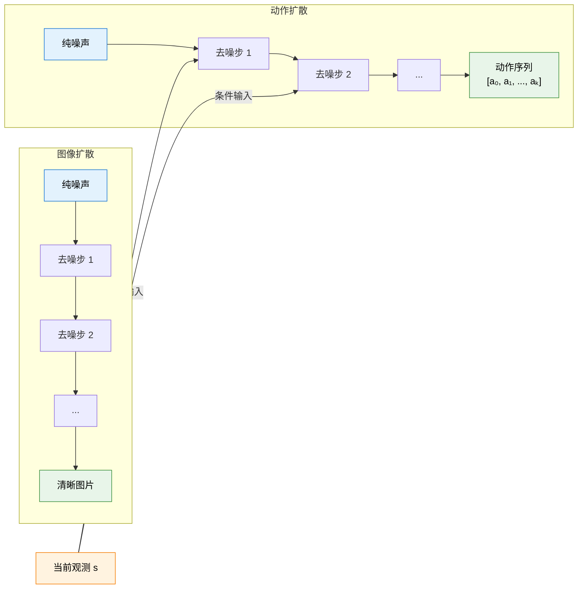

# 11.5 扩散策略（Diffusion Policy）：生成式连续控制

上一节我们通过 HER 解决了稀疏奖励问题。现在我们回到一个更根本的问题：**连续动作的策略表示应该长什么样？**

到目前为止我们学了两种表示：高斯策略（SAC）从单一分布中采样，确定性策略（DDPG/TD3）直接输出一个动作值。但真实世界的很多任务中，**同一个场景下可能有多种同样好的动作**——比如抓取一个杯子，从左侧抓和从右侧抓都行。高斯策略只能输出一个"均值"附近的动作，难以同时覆盖多种模式；确定性策略更糟，只能输出一个确定的动作。

2023-2024 年，一个来自扩散模型的想法席卷了机器人操作领域：**用扩散模型来生成动作序列**。这就是 Diffusion Policy [^1]。

## 从图像生成到动作生成

你可能已经熟悉扩散模型在图像生成中的应用（Stable Diffusion、DALL-E）。它的核心过程是：

1. **前向过程**：给一张清晰图片逐步加高斯噪声，直到变成纯噪声
2. **反向过程**：训练一个神经网络，学会从纯噪声一步步去噪，恢复出清晰图片

Diffusion Policy 的洞察是：**把"动作序列"当成"图片"来生成。** 输入是当前状态（观测），输出是一个动作序列——生成过程和图像生成完全一样，只是生成的内容从像素变成了机器人关节力矩。



## 为什么扩散策略比高斯策略强？

关键区别在于**多模态分布**的表达能力。

**高斯策略**（SAC）输出的动作分布是一个单峰的高斯钟形曲线。当你需要同时表达"往左抓"和"往右抓"两种好策略时，高斯分布只能给出一个折中的"往中间抓"——但往中间抓可能是最差的选择。

**扩散策略**没有这个限制。扩散模型的去噪过程可以在不同区域收敛到不同的"峰"，天然支持多模态分布。它可以用 50% 的概率生成"往左抓"的动作，50% 的概率生成"往右抓"的动作，而不会给出一个无意义的折中。

| 维度       | 高斯策略（SAC）  | 确定性策略（TD3） | 扩散策略                       |
| ---------- | ---------------- | ----------------- | ------------------------------ |
| 输出       | 均值 + 方差      | 单个动作值        | 动作序列上的去噪分布           |
| 多模态     | 不支持（单峰）   | 不支持            | **天然支持**                   |
| 动作相关性 | 每步独立         | 每步独立          | **生成序列，步间协调**         |
| 探索方式   | 熵正则化         | 外加噪声          | 去噪过程的随机性               |
| 训练信号   | 环境奖励（在线） | 环境奖励（在线）  | **通常从示范数据学习（离线）** |

最后一行揭示了一个重要特点：Diffusion Policy 通常用**行为克隆（Behavioral Cloning）**的方式训练——给定一批人类示范的轨迹数据，训练扩散模型学会生成类似的动作序列。这意味着它不需要在线交互，只需要看示范就能学会。

## 数学核心：条件去噪

Diffusion Policy 的训练目标是学习一个去噪网络 $\epsilon_\theta$，它在给定当前观测 $o_t$ 的条件下，预测添加到动作序列上的噪声：

$$\mathcal{L} = \mathbb{E}_{\mathbf{a} \sim \mathcal{D}, \, \epsilon \sim \mathcal{N}(0, I), \, k} \Big[ \| \epsilon - \epsilon_\theta(\mathbf{a}^k, k, o_t) \|^2 \Big]$$

其中：

- $\mathbf{a} = [a_t, a_{t+1}, \ldots, a_{t+H}]$ 是长度为 $H$ 的动作序列（从示范数据中采样）
- $\mathbf{a}^k$ 是在第 $k$ 步加噪后的动作序列
- $\epsilon$ 是添加的高斯噪声
- $\epsilon_\theta$ 是要去训练的噪声预测网络
- $o_t$ 是当前观测，作为条件输入

训练完成后，生成动作的过程就是标准的 DDPM 去噪：

```python
# ==========================================
# Diffusion Policy 推理：从噪声生成动作序列
# ==========================================
@torch.no_grad()
def generate_actions(denoise_net, observation, num_steps=16):
    """
    给定当前观测，用扩散去噪生成动作序列

    相比图像扩散（通常 1000 步），动作扩散只需 16 步左右
    因为动作序列的维度远低于图像（几十维 vs 百万像素）
    """
    action_dim = 8  # 例如 Ant 的 8 维动作
    horizon = 8     # 生成未来 8 步的动作

    # 从纯噪声开始
    noisy_actions = torch.randn(1, horizon, action_dim)

    for k in reversed(range(num_steps)):
        # 网络预测噪声
        predicted_noise = denoise_net(noisy_actions, k, observation)

        # 去噪一步
        alpha = get_alpha(k)          # 噪声调度参数
        alpha_bar = get_alpha_bar(k)  # 累积参数

        noisy_actions = (
            noisy_actions - (1 - alpha) / torch.sqrt(1 - alpha_bar) * predicted_noise
        ) / torch.sqrt(alpha)

        if k > 0:
            # 加入少量随机噪声（除了最后一步）
            noise = torch.randn_like(noisy_actions)
            noisy_actions += torch.sqrt(get_beta(k)) * noise

    # 返回生成的动作序列（取第一个动作执行，或执行整段序列）
    return noisy_actions[0]  # shape: [horizon, action_dim]
```

## 实际效果：机器人操作的新范式

Diffusion Policy 在 2024 年的机器人操作领域取得了突破性的成果。以下是一些代表性实验数据：

| 任务     | 方法                | 成功率  | 训练数据量 |
| -------- | ------------------- | ------- | ---------- |
| 杯子翻转 | LSTM BC（行为克隆） | 20%     | 200 次示范 |
| 杯子翻转 | Diffusion Policy    | **97%** | 200 次示范 |
| 双杯搬运 | LSTM BC             | 0%      | 200 次示范 |
| 双杯搬运 | Diffusion Policy    | **90%** | 200 次示范 |
| 酱汁倒入 | LSTM BC             | 10%     | 100 次示范 |
| 酱汁倒入 | Diffusion Policy    | **80%** | 100 次示范 |

双杯搬运任务最能说明问题：LSTM 行为克隆的成功率为 0%，因为这个任务需要**多模态策略**——先拿哪个杯子有多种选择。LSTM 会把不同的示范平均化，输出一个无意义的折中动作。Diffusion Policy 因为天然支持多模态分布，成功率从 0% 跳到 90%。

## 与前面章节的联系

| 概念                               | 在 Diffusion Policy 中的角色                            |
| ---------------------------------- | ------------------------------------------------------- |
| 高斯策略 vs 确定性策略（本章 11.2） | 扩散策略是第三条路——"生成式策略"                      |
| 离线学习                           | Diffusion Policy 通常从示范数据离线学习，不需要在线交互 |
| 经验回放（第 4 章）                | 示范数据集就是"离线经验"，不需要探索                    |
| DPO 的隐式奖励（第 8 章）          | 两者都用扩散过程建模分布，但 DPO 优化偏好，DP 优化模仿  |

<details>
<summary>思考题：Diffusion Policy 用行为克隆训练，不会受到"分布漂移"的影响吗？</summary>

会。行为克隆的经典问题是**复合误差（Compounding Error）**：训练时每一步都模仿示范，但推理时微小的误差会逐步累积，导致智能体偏离示范分布，进入从未见过的状态，然后做出错误决策。

Diffusion Policy 通过两个设计缓解了这个问题：

1. **生成动作序列而非单步动作**：一次生成未来 $H$ 步的动作，按序列执行，减少"一步错步步错"的累积。
2. **动作之间的隐式协调**：扩散模型在生成整个序列时，步与步之间通过去噪网络产生了隐式的协调——第 $t+1$ 步的动作会自然地"适配"第 $t$ 步的动作。

但根本性的分布漂移问题依然存在。目前的研究方向之一是把 Diffusion Policy 和 RL 结合——先用行为克隆训练一个扩散策略作为初始策略，再用在线 RL 进一步优化。这和第 8 章 DPO 的思路类似：先学一个合理的起点，再精细调优。

</details>

---

**参考文献**：

[^1]: Chi, C. et al. (2023). Diffusion Policy: Visuomotor Policy Learning via Action Diffusion. _RSS 2023_.
