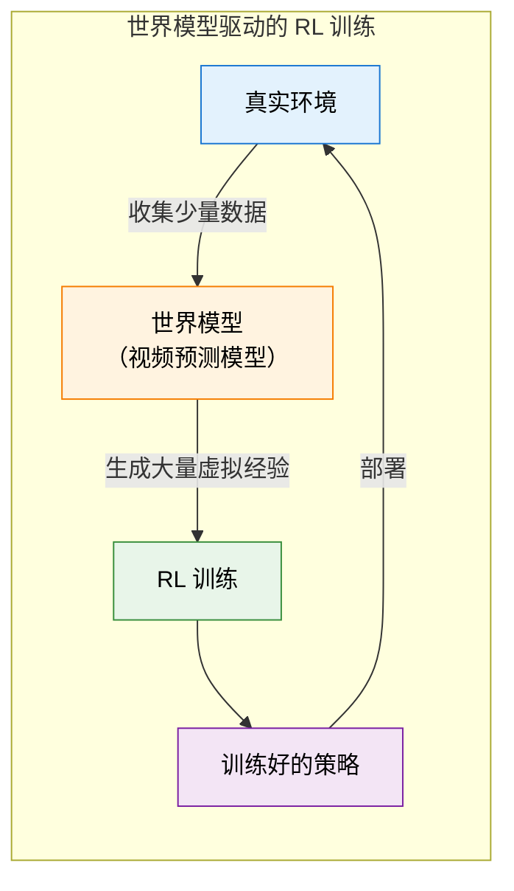

# 11.6 从仿真到现实：具身智能——RL 走进物理世界

前面的五节里，我们在 PyBullet 仿真器中训练了连续控制策略，掌握了 SAC/TD3 等算法，并用 Diffusion Policy 实现了生成式连续控制。但一个关键问题始终悬在空中：**仿真器里训练的策略，能在真实机器人上用吗？**

从数字世界到物理世界，RL 面临的根本性变化是：**试错有成本，错误有后果，环境无法快速重置**。

## 机器人 RL：从仿真到现实

机器人是具身智能最直接的应用场景。一个机器人需要学会：看到桌上的物体（感知），判断物体的大小和位置（理解），规划抓取路径（规划），控制关节角度执行抓取（控制）。这四个环节中，后面三个都可以用 RL 来优化。

### Sim-to-Real：在模拟器里训练，在真实世界执行

机器人 RL 的标准范式是 **Sim-to-Real（从仿真到现实）**：先在物理模拟器（如 MuJoCo、Isaac Lab）中训练策略，然后把训练好的策略迁移到真实机器人上。这个范式之所以必要，是因为真实机器人的交互成本太高了——一个机器人的一次尝试可能几秒钟，而 RL 通常需要几百万次尝试。

::: info Isaac Lab 替代 Isaac Gym
NVIDIA 的 Isaac Gym 已被标记为 deprecated，其继任者 **Isaac Lab** 是目前 GPU 并行机器人仿真的标准工具。Isaac Lab 基于 Isaac Sim 构建，支持万级机器人同时训练，同时兼容 Gymnasium 接口。如果你在做机器人 RL 研究，建议直接使用 Isaac Lab 而非 Isaac Gym。安装方式：`pip install isaacsim[all]`，详见 [Isaac Lab GitHub](https://github.com/isaac-sim/IsaacLab)。
:::

我们在上节已经用 PyBullet 体验过机器人仿真。Sim-to-Real 的核心挑战是**仿真和现实之间的差距（Sim-to-Real Gap）**：

- **物理差距**：模拟器中的摩擦力、重力、碰撞都是理想化的，真实世界的物理要复杂得多
- **感知差距**：模拟器提供精确的状态信息（关节角度、物体位置），真实机器人只能通过摄像头和力传感器来估计
- **动力学差距**：模拟器中的电机响应是即时的，真实电机有延迟和非线性

### 域随机化：弥补 Sim-to-Real Gap

**域随机化（Domain Randomization）** 是解决 Sim-to-Real Gap 最常用的技术。核心思想极其简单：在模拟器中**大量随机化环境参数**——摩擦力在 0.3-0.7 之间随机、物体颜色随机、光照条件随机、传感器噪声随机。这样训练出来的策略不再依赖于特定的物理参数，而是学会了在各种条件下都能工作。

```python
def domain_randomized_env(base_params):
    """域随机化：在训练时随机化物理参数"""
    randomized = {}
    randomized["friction"] = np.random.uniform(0.3, 0.7)
    randomized["gravity"] = base_params["gravity"] * np.random.uniform(0.9, 1.1)
    randomized["joint_damping"] = np.random.uniform(0.01, 0.1)
    randomized["object_mass"] = base_params["mass"] * np.random.uniform(0.8, 1.2)
    randomized["camera_noise"] = np.random.normal(0, 0.01)
    return randomized
```

直觉上，这就像一个篮球运动员在训练时故意用不同气压的球、不同摩擦力的地板、不同亮度的灯光来练习——这样到了正式比赛，无论条件如何都能适应。

## 多模态感知：看、听、触的融合

具身智能不只是"机器人抓东西"——它要求智能体具备**多模态**的感知能力。一个家庭服务机器人需要同时利用视觉（看到物体）、力觉（感知抓取力度）、本体感觉（知道手臂的位置）等多种信息来做决策。每种模态的采样频率和信息密度都不同——摄像头每秒 30 帧，力传感器每秒 1000 次，而语言指令可能只给出一次。

从 RL 的角度来看，多模态融合本质上是一个**状态表征学习**问题。你需要把多个模态的信息压缩成一个统一的状态表示 $s_t$，然后在这个表示上做策略优化。

```python
class MultiModalEncoder(nn.Module):
    """多模态编码器：将不同模态的信息融合为统一的状态表示"""

    def __init__(self):
        super().__init__()
        self.vision_encoder = CNNEncoder(output_dim=256)   # 视觉
        self.force_encoder = MLPEncoder(input_dim=6, output_dim=64)  # 力觉（6轴力传感器）
        self.proprio_encoder = MLPEncoder(input_dim=12, output_dim=64) # 本体感觉（12个关节角度）
        self.fusion = nn.Linear(256 + 64 + 64, 128)        # 融合层

    def forward(self, image, force, joint_angles):
        v = self.vision_encoder(image)
        f = self.force_encoder(force)
        p = self.proprio_encoder(joint_angles)
        return self.fusion(torch.cat([v, f, p], dim=-1))
```

这种多模态融合的思路，和上一章 VLM RL 中视觉+语言的融合是同一类问题——只是模态从"视觉+语言"扩展到了"视觉+力觉+本体感觉"。RL 的作用是：通过 reward 信号，让模型学会在决策中**合理权衡**不同模态的信息。

## Google RT-2：用 VLM 直接控制机器人

Google 的 RT-2（Robotic Transformer 2）展示了 RL 在机器人领域的另一种可能：**用视觉语言模型（VLM）直接输出机器人控制指令**。RT-2 接收摄像头画面和语言指令（比如"把红色的杯子拿起来"），直接输出机器人的关节角度。这和上一章 VLM RL 的思路一脉相承——用多模态模型理解环境，再输出动作。

## 世界模型：无限虚拟经验的可能

面对样本效率的挑战，一个令人兴奋的方向是**用世界模型（World Model）来生成无限的虚拟训练经验**。世界模型是一个能预测"做了动作 a 之后，环境会变成什么样"的生成模型。如果世界模型足够准确，RL 智能体就可以在"脑内"进行无数次试错，而不用在真实世界中做任何尝试。



Sora 等视频生成模型展示了"用视频预测物理世界"的可能性。虽然当前的视频生成模型还不够准确到直接用于 RL 训练，但这个方向正在快速发展。想象一下：未来你可以用一个高质量的世界模型，为机器人生成数百万个虚拟场景来训练——厨房、工厂、医院、家庭——然后直接迁移到真实世界。

## 具身智能的核心挑战

| 挑战     | 数字世界（如 CartPole） | 物理世界（如机器人）           |
| -------- | ----------------------- | ------------------------------ |
| 环境重置 | `env.reset()`，毫秒级   | 人工或机械臂重置，分钟级       |
| 试错成本 | 几乎为零                | 时间、能源、设备损耗           |
| 安全约束 | 无（倒杆无害）          | 严格（碰撞、跌倒可能损坏设备） |
| 样本效率 | 可以大量试错            | 必须高效利用每一次交互         |
| 感知噪声 | 精确的状态向量          | 有噪声的传感器数据             |
| 泛化要求 | 固定环境                | 多变的环境（光照、天气、物体） |

**样本效率**可能是最核心的挑战。标准的 Model-Free RL（如本章覆盖的 SAC/TD3）需要海量的交互数据。在数字世界中，这可以通过快速模拟来解决。但在物理世界中，每一次交互都有实际成本。

## 与前面章节的联系

| 前面章节的概念            | 在具身智能中的对应                          |
| ------------------------- | ------------------------------------------- |
| DQN 的经验回放（第 4 章） | 从真实环境收集的经验非常珍贵，必须高效复用  |
| 连续动作控制（本章）      | 机器人关节角度是连续的，需要 SAC/TD3 等算法 |
| Diffusion Policy（本章）  | 多模态动作生成，适合多样化的机器人操作      |
| VLM RL（第 10 章）        | 视觉语言模型为机器人提供感知和语言理解能力  |
| HER（本章 11.4）          | 稀疏奖励下利用失败轨迹                      |

具身智能让 RL 从"数字世界的游戏"走向"物理世界的行动"。

<details>
<summary>思考题：域随机化和世界模型是解决 Sim-to-Real Gap 的两种思路。它们的优缺点分别是什么？</summary>

**域随机化**的优点是简单有效——只需要在模拟器中随机化参数，不需要额外的模型训练。缺点是它只能覆盖参数化的不确定性——如果你没有预料到某个维度的变化（比如真实世界中有一只猫走进了场景），域随机化就无法应对。

**世界模型**的优点是更灵活——它可以从真实数据中学习环境的动态规律，覆盖域随机化无法预见的复杂性。缺点是它需要大量真实数据来训练，而且世界模型本身可能有误差——如果世界模型对某个场景的预测不准确，RL 智能体可能学到错误的策略。

实践中，两者常常结合使用：域随机化作为基础策略，世界模型作为补充——用于模拟那些难以参数化的复杂场景。

</details>
