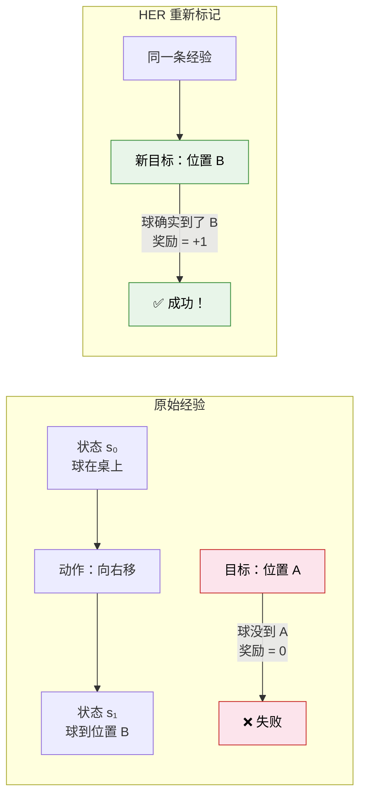

# 11.4 事后经验回放（HER）：把失败变成成功

到目前为止，我们的智能体训练都依赖一个前提：每一步都能收到明确的奖励信号。CartPole 倒了就给 -1，Atari 游戏每一步都有分数，LunarLander 着陆成功有明确的奖励。但在真实的机器人任务中，奖励往往是**极度稀疏**的。

想象一个机器人要完成"把杯子放到指定位置"的任务。它需要在 10 维连续动作空间中协调关节运动，可能需要 100 步连续正确的操作。如果只有"杯子到了指定位置"才给 +1，其余全给 0，那么机器人随机尝试一百万次也未必能碰到一次成功——没有成功经验，就无法学习。这就是**稀疏奖励问题**。

## 核心思想：换个目标，失败就是成功

HER（Hindsight Experience Replay）[^1] 的核心洞察极其优雅：**你虽然没有完成你设定的目标，但你完成了另一个目标——只是你还没意识到。**

具体来说，假设智能体的目标是"把球放到位置 A"，但它实际上把球放到了位置 B。从目标 A 的角度看，这次经验是失败的。但从目标 B 的角度看，这次经验是一次完美的成功——智能体确实把球放到了位置 B，只是 B 不是它原本想要的位置。

HER 做的事情就是：**把每条"失败"的经验重新标记一个新的目标（即实际达到的状态），然后当成"成功"经验存入回放池。**



## 数学形式化：目标条件 Q-Learning

HER 建立在**目标条件强化学习（Goal-Conditioned RL）**的框架上。标准 RL 的策略是 $\pi(a|s)$，只看当前状态就决定动作。目标条件 RL 的策略是 $\pi(a|s, g)$，同时看当前状态和目标来决定动作。

对应地，Q 函数也变成 $Q(s, a, g)$——在状态 $s$ 下做动作 $a$，为了达成目标 $g$，期望能拿多少分。奖励函数也依赖于目标：

$$r_g(s, a, s') = \begin{cases} 0 & \text{如果 } s' \text{ 达成了目标 } g \\ -1 & \text{否则} \end{cases}$$

HER 的训练流程如下：

```python
# ==========================================
# HER 训练流程（与 DDPG 结合）
# ==========================================
import numpy as np
from collections import defaultdict

class HERReplayBuffer:
    """带事后经验回放的缓冲区"""

    def __init__(self, max_size=100000, k_future=4):
        self.max_size = max_size
        self.k_future = k_future  # 每条经验额外生成几个"新目标"版本
        self.buffer = []

    def add_episode(self, episode):
        """
        添加一条完整轨迹。
        episode = [(s0, a0, r0, s1, g), (s1, a1, r1, s2, g), ...]
        """
        self.buffer.append(episode)
        if len(self.buffer) > self.max_size:
            self.buffer.pop(0)

    def sample(self, batch_size):
        """采样训练数据，包含原始经验和 HER 重新标记的经验"""
        batch = []
        for _ in range(batch_size):
            # 随机选一条轨迹
            ep = self.buffer[np.random.randint(len(self.buffer))]
            # 随机选一个时间步
            t = np.random.randint(len(ep))
            state, action, _, next_state, goal = ep[t]

            # 原始经验（原始目标）
            reward_orig = self._compute_reward(next_state, goal)
            batch.append((state, action, reward_orig, next_state, goal, False))

            # HER：用轨迹中后续实际达到的状态作为新目标
            for _ in range(self.k_future):
                # 从同一条轨迹中随机选一个未来状态作为新目标
                future_t = np.random.randint(t, len(ep))
                new_goal = ep[future_t][3]  # 未来状态作为新目标

                # 用新目标重新计算奖励
                reward_new = self._compute_reward(next_state, new_goal)
                batch.append((state, action, reward_new, next_state, new_goal, False))

        return batch

    def _compute_reward(self, state, goal):
        """判断状态是否达成了目标"""
        # 简单的欧氏距离判断：距离目标足够近就算成功
        dist = np.linalg.norm(state - goal)
        return 0 if dist < 0.05 else -1

# 使用示例：HER + DDPG 训练 FetchReach
buffer = HERReplayBuffer(max_size=100000, k_future=4)

for episode in range(1000):
    # 在环境中收集一条轨迹
    obs, info = env.reset()
    goal = obs["desired_goal"]       # 环境给出的目标位置
    achieved = obs["achieved_goal"]  # 机器人末端实际位置

    episode_data = []
    for step in range(50):
        state = obs["observation"]
        action = agent.select_action(state, goal)
        next_obs, reward, done, truncated, info = env.step(action)

        episode_data.append((state, action, reward, next_obs["achieved_goal"], goal))
        obs = next_obs
        if done:
            break

    # 将整条轨迹存入 HER 缓冲区
    buffer.add_episode(episode_data)

    # 从缓冲区采样（包含 HER 重新标记的经验）训练 DDPG
    for _ in range(40):
        batch = buffer.sample(batch_size=256)
        agent.update(batch)
```

## 为什么 HER 有效？

HER 有效的原因可以归结为三个要点：

**1. 变废为宝，数据利用率飙升。** 一条 100 步的失败轨迹，原本对"原始目标"来说几乎无用。但通过 HER 重新标记，这条轨迹中的每一步都可以变成"为了达到某个实际访问过的状态"的成功经验。一条轨迹的利用效率提高了 $k$ 倍（$k$ 是每步额外采样的新目标数）。

**2. 信用分配变得简单。** 在稀疏奖励中，"我做了什么导致了成功"是一个极难回答的问题。但 HER 的重新标记让每条经验都有明确的因果关系：从状态 $s$ 做了动作 $a$ 之后确实达到了 $s'$，所以对"达到 $s'$"这个目标来说，$(s, a)$ 就是一个好的训练样本。

**3. 课程学习的自然涌现。** HER 不需要人为设计由易到难的课程。随机探索时，智能体自然会先到达附近的状态（容易的"新目标"），学会如何达到这些状态后，逐渐能到达更远的状态（更难的"新目标"）。这个由易到难的过程是自动涌现的。

## 在 Gymnasium 中动手：FetchReach

Gymnasium 的 `FetchReach` 环境是 HER 的标准测试环境——控制一个 7-DOF 机械臂末端执行器到达指定的 3D 目标位置。奖励极度稀疏：只有末端距离目标 < 5cm 才给 0，否则给 -1。

```python
# ==========================================
# FetchReach 环境 + HER 演示
# ==========================================
import gymnasium as gym

# FetchReach 环境（需要安装 gymnasium-robotics）
# pip install gymnasium-robotics
env = gym.make("FetchReach-v3")

obs, info = env.reset()
print("观测空间包含三个关键字段：")
print(f"  observation:    机器人状态（关节角、速度、末端位置）→ {obs['observation'].shape}")
print(f"  desired_goal:   目标位置 → {obs['desired_goal'].shape}")
print(f"  achieved_goal:  当前末端位置 → {obs['achieved_goal'].shape}")

# 一步交互
action = env.action_space.sample()
next_obs, reward, terminated, truncated, info = env.step(action)
print(f"\n动作: {action}")
print(f"奖励: {reward}")  # 几乎肯定是 -1（随机动作不太可能命中目标）
print(f"距离目标: {np.linalg.norm(next_obs['achieved_goal'] - next_obs['desired_goal']):.4f}")
```

### HER vs 无 HER 的训练对比

| 方法           | FetchReach 成功率 | 所需交互步数 | 说明                               |
| -------------- | ----------------- | ------------ | ---------------------------------- |
| DDPG（无 HER） | < 5%              | 100K+        | 稀疏奖励下几乎无法学习             |
| DDPG + HER     | > 90%             | ~20K         | HER 将稀疏奖励转化为密集信号       |
| SAC（无 HER）  | < 10%             | 100K+        | SAC 的探索优势在极度稀疏奖励下不够 |
| SAC + HER      | > 95%             | ~15K         | 当前 FetchReach 的最佳组合         |

这个对比清楚地说明：**在稀疏奖励场景中，HER 带来的提升远大于算法本身的差异。** DDPG + HER 能打败 SAC 无 HER——因为 HER 解决的是"信号从哪里来"的根本问题，而算法解决的是"如何利用信号"的优化问题。

## 与前面章节的联系

| 概念                    | 在 HER 中的角色                                                |
| ----------------------- | -------------------------------------------------------------- | ------------------------------------------------- |
| 经验回放（第 4 章 DQN） | HER 是经验回放的高级变体——不只是随机采样，而是改变了"目标标签" |
| 目标条件策略            | $\pi(a                                                         | s, g)$ 和第 8 章的 DPO 有类似的结构——都是条件生成 |
| 稀疏奖励 vs 密集奖励    | 第 4 章 Atari 的密集分数 vs FetchReach 的二元成功/失败         |
| DDPG（本章上一节）      | HER + DDPG 是稀疏奖励连续控制的标准组合                        |
| ECHO（第 9 章）         | HER 思想在 LLM 轨迹上的应用——失败轨迹换个目标变成成功轨迹      |

<details>
<summary>思考题：HER 的"新目标"只从同一条轨迹的未来状态中选取。如果从其他轨迹中选取会怎样？</summary>

从其他轨迹选取新目标是可行的，但效果通常不如从同一条轨迹选取。原因是：

从同一条轨迹选取，保证了**因果性**——从状态 $s_t$ 执行动作 $a_t$ 确实导致了 $s_{t'}$（$t' > t$），所以 $(s_t, a_t, s_{t'})$ 是一条真实的因果链。如果从其他轨迹选取状态作为目标，你不知道从当前状态做当前动作是否能到达那个目标——它可能是一个完全不可达的目标，会产生错误的训练信号。

不过，如果任务环境中存在大量的共享结构（比如同一个机器人在不同目标点之间移动），跨轨迹选取也是可行的——只需要额外验证可达性。这是一个活跃的研究方向。

</details>

---

**参考文献**：

[^1]: Andrychowicz, M. et al. (2017). Hindsight Experience Replay. _NeurIPS_.
