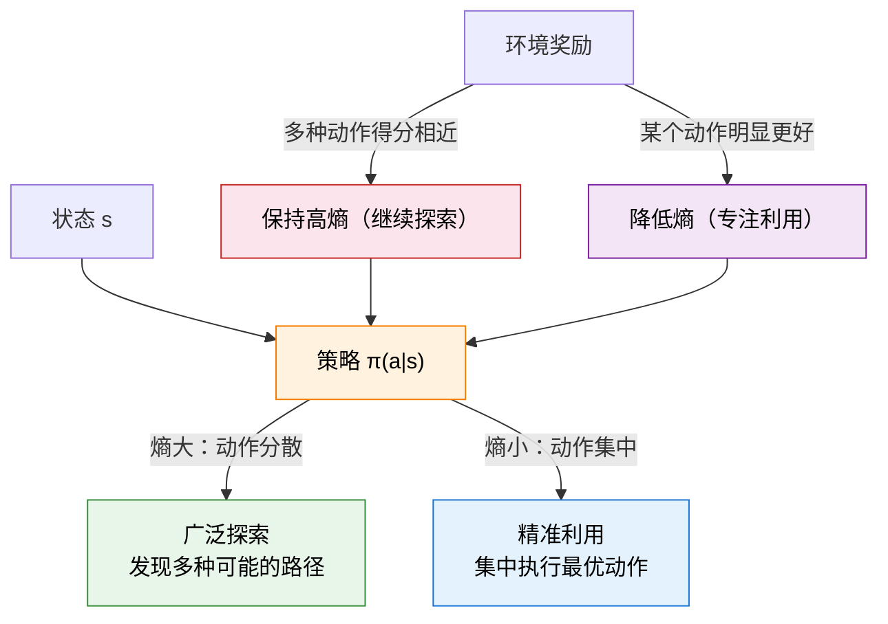

# 11.3 SAC、算法对比与并行采样

上一节我们理解了连续策略的两种表示，并跟着 DDPG 和 TD3 看到了确定性策略路线的完整演进。TD3 通过三剂良药解决了 Q 值过估计问题，但确定性策略始终有一个绕不开的局限——探索是"外挂"的，噪声加多加少全靠手动调参。

这一节我们来看连续控制的另一条路线：**SAC（Soft Actor-Critic）**，它用一个优雅的数学框架把探索和利用统一了起来，被认为是目前连续控制领域最强大的通用算法。我们还会横向对比 PPO、TD3、SAC 三大算法，帮你建立工程选型的判断力。

## 11.3.1 最大熵强化学习：既要高分又要随机

标准 RL 的目标很单纯：最大化累积奖励。

$$J_{\text{standard}} = \mathbb{E}\left[\sum_{t=0}^{\infty} \gamma^t r_t\right]$$

SAC 背后的思想——**最大熵强化学习**——在这个目标后面加了一项：

$$J_{\text{max-ent}} = \mathbb{E}\left[\sum_{t=0}^{\infty} \gamma^t \big(r_t + \alpha \, \mathcal{H}(\pi(\cdot|s_t))\big)\right]$$

多出来的 $\alpha \, \mathcal{H}(\pi(\cdot|s_t))$ 是策略在状态 $s_t$ 处的熵（Entropy），乘以温度系数 $\alpha$。熵 $\mathcal{H}$ 衡量的是分布的"随机程度"——分布越均匀，熵越大；分布越集中，熵越小。

$$\mathcal{H}(\pi(\cdot|s)) = -\int \pi(a|s) \log \pi(a|s) \, da$$

这个修改的含义极其深刻：**智能体不仅要拿高分，还要保持动作分布尽可能随机**。乍一看这似乎在鼓励智能体"故意不学最优"，但实际上它解决了一个核心问题——探索。



最大熵目标的精妙之处在于它的**自适应性**：

- 如果某个状态下多个动作得分差不多（比如在平地上，往左跑和往右跑都行），熵的奖励会鼓励策略保持随机——继续探索，说不定有一条更好的路。
- 如果某个状态下某个动作明显更好（比如前面有个悬崖，必须左转），奖励信号会压过熵的奖励，策略自然变得确定——集中力量执行最优动作。

这就是 SAC "探索-利用" 权衡的核心机制——**不是靠外加噪声，而是靠目标函数中的熵项自动调节**。

## 11.3.2 SAC 算法核心

SAC 的完整算法包含多个组件，但核心更新步骤可以浓缩为三部分：Critic 更新、Actor 更新、温度自适应。

**Critic 更新**和 TD3 类似，也使用截断双 Q 学习：

$$y = r + \gamma \left(\min_{i=1,2} Q_{\phi_i^-}(s', \tilde{a}') - \alpha \log \pi_\theta(\tilde{a}'|s')\right)$$

注意和 TD3 的区别：TD Target 中多了一项 $-\alpha \log \pi_\theta(\tilde{a}'|s')$——这就是熵正则化项。它把"保持随机"的奖励直接写进了 Q 值的目标中。这里的 $\tilde{a}'$ 是从当前策略采样的，不是 Actor 确定性输出的。

**Actor 更新**的目标是最大化包含熵的"软 Q 值"：

$$\nabla_\theta J(\theta) \approx \mathbb{E}\left[\nabla_\theta \log \pi_\theta(a|s) \big(\alpha \log \pi_\theta(a|s) - Q_\phi(s, a)\big)\right]$$

直觉：如果 $Q_\phi(s, a)$ 大于 $\alpha \log \pi_\theta(a|s)$（这个动作真的很好），就增加这个动作的概率；否则就降低。

**温度 $\alpha$ 自适应调节**是 SAC 的一大亮点。$\alpha$ 控制熵在目标中的权重——太大则策略永远随机不收敛，太小则退化为没有探索的确定性策略。SAC 通过以下目标自动调节 $\alpha$：

$$\alpha^* = \arg\min_\alpha \; \mathbb{E}_{a \sim \pi}\left[-\alpha \log \pi(a|s) - \alpha \, \bar{\mathcal{H}}\right]$$

其中 $\bar{\mathcal{H}}$ 是目标熵（通常取 $-\dim(\mathcal{A})$，即动作空间维度的负数）。当策略熵高于目标时，$\alpha$ 自动减小（降低对探索的鼓励）；当策略熵低于目标时，$\alpha$ 自动增大（增加探索）。无需手动调参。

下面是一段 SAC 核心更新步骤的代码：

```python
import torch
import torch.nn.functional as F

def sac_update(actor, critic1, critic2, target_critic1, target_critic2,
               alpha, alpha_optimizer, log_alpha,
               replay_buffer, actor_optimizer, critic_optimizer,
               batch_size, gamma, target_entropy):

    states, actions, rewards, next_states, dones = replay_buffer.sample(batch_size)

    with torch.no_grad():
        # 从当前策略采样下一状态的动作（重参数化技巧）
        next_actions, next_log_probs = actor.sample(next_states)
        # 截断双 Q：取两个 Critic 的较小值，减去熵项
        next_q1 = target_critic1(next_states, next_actions)
        next_q2 = target_critic2(next_states, next_actions)
        next_q = torch.min(next_q1, next_q2) - alpha * next_log_probs
        # 计算 TD Target
        target_q = rewards + gamma * (1 - dones) * next_q

    # --- Critic 更新（两个 Critic 独立更新） ---
    current_q1 = critic1(states, actions)
    current_q2 = critic2(states, actions)
    critic_loss = F.mse_loss(current_q1, target_q) + F.mse_loss(current_q2, target_q)

    critic_optimizer.zero_grad()
    critic_loss.backward()
    critic_optimizer.step()

    # --- Actor 更新 ---
    new_actions, log_probs = actor.sample(states)
    q1_new = critic1(states, new_actions)
    q2_new = critic2(states, new_actions)
    q_new = torch.min(q1_new, q2_new)
    # Actor 损失 = 熵项 - Q 值（取负号做梯度下降，因为要最大化 Q - α log π）
    actor_loss = (alpha * log_probs - q_new).mean()

    actor_optimizer.zero_grad()
    actor_loss.backward()
    actor_optimizer.step()

    # --- 温度 α 自适应调节 ---
    alpha_loss = -(log_alpha * (log_probs + target_entropy).detach()).mean()

    alpha_optimizer.zero_grad()
    alpha_loss.backward()
    alpha_optimizer.step()
    alpha = log_alpha.exp().item()

    return critic_loss.item(), actor_loss.item(), alpha
```

注意第 11 行的 `actor.sample(next_states)`——Actor 需要提供一个 `sample` 方法，使用**重参数化技巧**（Reparameterization Trick）来实现可微的采样：

```python
class GaussianActor(nn.Module):
    """高斯策略网络：输出均值和对数标准差，支持可微采样"""
    def __init__(self, state_dim, action_dim):
        super().__init__()
        self.net = nn.Sequential(
            nn.Linear(state_dim, 256), nn.ReLU(),
            nn.Linear(256, 256), nn.ReLU(),
        )
        self.mean_layer = nn.Linear(256, action_dim)
        self.log_std_layer = nn.Linear(256, action_dim)

    def sample(self, state):
        mean = self.mean_layer(self.net(state))
        log_std = self.log_std_layer(self.net(state)).clamp(-20, 2)
        std = log_std.exp()
        # 重参数化：a = μ + σ * ε，其中 ε ~ N(0, I)
        normal = torch.distributions.Normal(mean, std)
        x = normal.rsample()  # rsample 使梯度能流过采样过程
        action = torch.tanh(x)  # 压缩到 [-1, 1]
        # 修正 log_prob（因为 tanh 变换会改变分布形状）
        log_prob = normal.log_prob(x) - torch.log(1 - action.pow(2) + 1e-6)
        log_prob = log_prob.sum(dim=-1, keepdim=True)
        return action, log_prob
```

重参数化技巧是 SAC 能用梯度训练 Actor 的关键——普通的采样操作 `a ~ N(μ, σ²)` 是不可微的（你无法对随机操作求梯度）。重参数化把它改写为 $a = \mu + \sigma \cdot \epsilon$，其中 $\epsilon \sim \mathcal{N}(0, 1)$。随机性被推到了 $\epsilon$ 上，而 $a$ 关于 $\mu$ 和 $\sigma$ 是可微的。

## 11.3.3 为什么 SAC 是连续控制的 Top 1？

SAC 在连续控制领域被广泛视为默认首选算法，原因可以归结为三点：

**1. 优雅的探索-利用权衡。** 不像 DDPG/TD3 需要手动设计噪声策略（Ornstein-Uhlenbeck？高斯？噪声多大？），SAC 的最大熵框架让探索自然融入目标函数。温度 $\alpha$ 自动调节，省去了一个关键的超参数。

**2. 鲁棒性与样本效率。** SAC 是 off-policy 算法——它从经验回放池中复用旧数据，样本效率远高于 on-policy 的 PPO。同时，熵正则化提供了一种隐式的正则化效果，防止策略过早收敛到局部最优，比 TD3 更不容易"崩"。

**3. 自动温度调节。** 这一点看似细小，实则重要。RL 算法最让人头疼的就是超参数敏感——换一个环境就要重新调参。SAC 的 $\alpha$ 自适应机制让它在不同任务上都能自动找到合适的探索-利用平衡点，大幅降低了调参成本。

## 11.3.4 三大算法横向对比

让我们在 HalfCheetah（MuJoCo 猎豹奔跑环境）上对 PPO、TD3、SAC 做一个全面对比：

| 维度                 | PPO                      | TD3                 | SAC                    |
| -------------------- | ------------------------ | ------------------- | ---------------------- |
| 策略类型             | 高斯策略                 | 确定性策略          | 高斯策略               |
| On/Off-policy        | On-policy                | Off-policy          | Off-policy             |
| 样本效率             | 低（不能用旧数据）       | 高（经验回放）      | 高（经验回放）         |
| 探索机制             | 策略固有熵 + clip        | 外加噪声            | 最大熵目标 + 自适应 α  |
| 训练稳定性           | 高（on-policy 天然稳定） | 中（需调噪声参数）  | 高（α 自适应）         |
| 调参难度             | 低（少超参数）           | 中（噪声类型/大小） | 低（α 自动调节）       |
| 代码复杂度           | 低                       | 中                  | 中                     |
| HalfCheetah 收敛速度 | 慢（需要更多环境交互）   | 快                  | 快                     |
| 复杂环境探索能力     | 一般                     | 一般                | 强（熵鼓励多路径探索） |

从表格中可以提炼出几个关键的选型建议：

- **大模型对齐（LLM/GRPO）**：选 PPO 或 GRPO。LLM 的动作空间是离散的（token 选择），PPO 的 on-policy 特性在这里反而是优势——它保证了训练数据始终来自最新策略，避免了 off-policy 方法中旧策略数据分布偏移（distribution shift）的问题。
- **机器人连续控制**：选 SAC 或 TD3。SAC 在大多数连续控制任务上表现更好，特别是环境复杂、需要大量探索的场景。TD3 在奖励信号稀疏但精确的任务上可能更合适。
- **资源有限、快速验证**：选 PPO。它是最容易实现的，对超参数最不敏感，on-policy 的特性让调试更直观。

<details>
<summary>思考题：什么情况下应该优先选择 TD3 而不是 SAC？</summary>

当任务奖励信号非常稀疏但高度精确时，TD3 可能优于 SAC。SAC 的最大熵目标会鼓励策略保持随机，这在奖励稀疏的环境中可能导致策略"到处乱跑"而无法集中精力找到唯一正确的路径。此外，如果你的任务环境非常简单（比如低维状态、单个关节控制），TD3 的确定性策略加上少量噪声就够了，最大熵的额外计算开销反而是浪费。最后，在需要确定性执行的部署场景（不允许策略有随机性），TD3 的确定性策略更直接——不过 SAC 也可以在部署时关闭采样，只使用均值。

</details>

## 11.3.5 并行采样：让训练加速 8 倍

不管用哪个算法，RL 训练最稀缺的资源永远是**环境交互数据**。一个加速训练的直接方法是：同时运行多个环境实例，并行收集数据。

```python
import gymnasium as gym
from stable_baselines3.common.vec_env import SubprocVecEnv

def make_env(env_id, seed):
    """创建环境工厂函数，每个进程独立随机种子"""
    def _init():
        env = gym.make(env_id)
        env.reset(seed=seed)
        return env
    return _init

# 创建 8 个并行环境
num_envs = 8
envs = SubprocVecEnv([make_env("HalfCheetah-v4", seed=i) for i in range(num_envs)])

# 每一步获得 8 倍的数据
obs = envs.reset()  # 返回 8 个环境的观测
for step in range(1000):
    actions = model.predict(obs)           # 同时为 8 个环境选择动作
    obs, rewards, dones, infos = envs.step(actions)  # 8 个环境同时执行
```

并行采样有几个关键细节值得注意：

**为什么 PPO 特别受益？** PPO 是 on-policy 算法——它只能用当前策略产生的数据训练，旧数据必须丢弃。这意味着 PPO 需要**大量新鲜数据**才能稳定训练。并行采样正好满足这个需求：8 个环境同时跑，每步产生 8 条经验，PPO 的数据饥渴被大幅缓解。对于 SAC 和 TD3 这种 off-policy 算法，并行采样也有帮助（填充经验回放池更快），但提升没有 PPO 那么显著。

**独立随机种子至关重要。** 如果所有环境用相同的种子，它们会产生完全一样的轨迹——8 个环境等于 1 个。独立的种子保证每个环境经历不同的状态序列，数据的多样性是并行采样有效的前提。

**进程 vs 线程。** `SubprocVecEnv` 用多进程（而非多线程）实现并行，因为 Python 的 GIL（全局解释器锁）会让多线程在 CPU 密集的环境模拟中无法真正并行。每个进程独立运行一个环境实例，互不干扰。

## 11.3.6 本节总结

这一章，我们从离散动作空间跨越到连续控制，掌握了一套完整的知识体系：

**从直觉到理论**：PyBullet 仿真让我们亲手操控机器人关节，建立了对连续动作空间的直觉——动作不再是"选 A 还是 B"，而是"输出一个多维力矩向量"。

**两种策略路线**：高斯策略（PPO、SAC）从分布中采样动作，内置探索；确定性策略（DDPG、TD3）直接输出动作值，需要外加噪声。选择哪种策略是连续控制的第一步设计决策。

**算法演进逻辑**：DDPG 把 DQN 搬到连续空间 → Q 值过估计 → TD3 用双 Critic 取 min、延迟更新、目标平滑三剂良药 → SAC 用最大熵统一探索和利用。每一步改进都针对前一步的具体问题，理解这条演进线比记住公式更重要。

**工程选型指南**：LLM 对齐选 PPO/GRPO，机器人控制选 SAC/TD3，快速验证选 PPO。并行采样是加速训练的通用手段，PPO 受益最大。

但 SAC/TD3/PPO 都有一个共同的局限——面对**稀疏奖励**时难以学习。下一节我们来认识一个简单却强大的技巧——[HER：把失败变成成功](./her-sparse-reward)，看看如何通过"换个目标"来破解稀疏奖励难题。之后我们还会介绍一种全新的策略表示方式——[扩散策略：生成式连续控制](./diffusion-policy)，它正在改写机器人操作的规则。

---

**延伸阅读**：

- Haarnoja, T. et al. (2018). Soft Actor-Critic: Off-Policy Maximum Entropy Deep Reinforcement Learning with a Stochastic Actor. _ICML_.
- Fujimoto, S. et al. (2018). Addressing Function Approximation Error in Actor-Critic Methods. _ICML_.
- Lillicrap, T. et al. (2016). Continuous Control with Deep Reinforcement Learning. _ICLR_.
