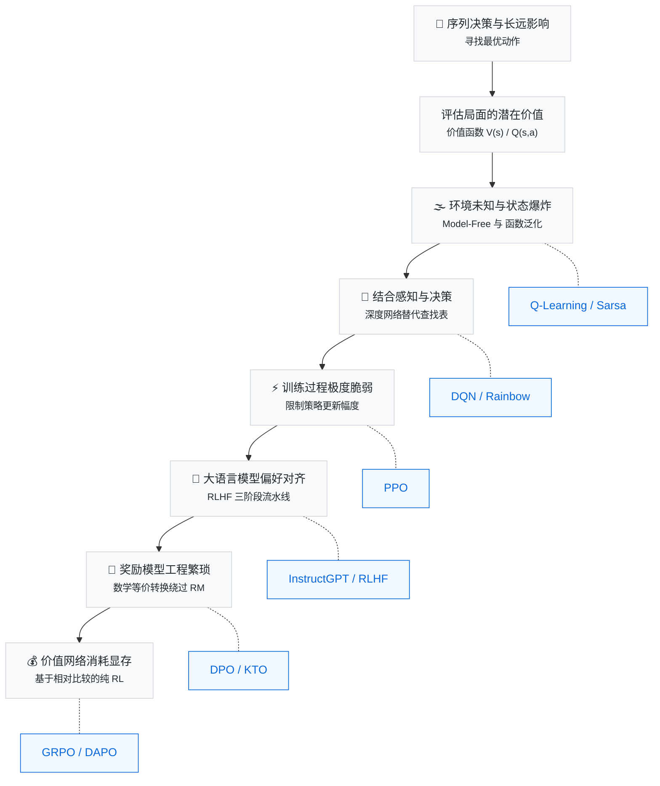

# 前言

> 每个人都是过去经验的总和。

## 为什么我们需要强化学习？

想象一下你正在教一个小孩骑自行车。

你不会先递给他一本厚厚的《自行车物理学与平衡方程》，也不会在他上车前详细规定“当车身向左倾斜 5 度时，你的右脚必须施加 10 牛顿的力”。这种精确到毫秒和牛顿的“指令式”教学在现实中是行不通的。相反，你只是帮他扶着后座，鼓励他自己去蹬踏板。当他失去平衡摔倒时，擦伤的膝盖会给他一个负面的反馈；当他偶然间掌握了平衡，迎面吹来的风和前行的喜悦就是他最好的奖励。几次尝试之后，他的大脑便在一次次试错中，自动学会了如何调整重心。

**在未知环境中通过试错（Trial and Error）来学习，并以最终的回报为导向，这正是人类乃至所有生物最本能的学习方式。**

当我们试图让人工智能也拥有这种能力时，强化学习（Reinforcement Learning, RL）便应运而生了。

在过去的深度学习浪潮中，我们习惯了监督学习的模式：准备成千上万张带有标签的图片，让模型学习如何区分猫和狗。监督学习擅长“识别”和“预测”，它依赖于人类提供的标准答案。但世界上的很多问题并没有标准答案，或者标准答案的成本高到无法承受。

比如，你想让一个机械臂学会抓取形状各异的水杯，或者想让 AI 在星际争霸中打败职业选手，你不可能穷举出所有可能出现的画面，并标注出每一步的最优操作。更典型的是，当我们希望拥有千亿参数的大语言模型（如 ChatGPT 或 DeepSeek）能够得体、安全且符合人类逻辑地回答问题时，我们同样无法写死所有的对话规则。

面对这些**需要在一系列动态变化中做连续决策**的难题，强化学习提供了一套优雅的解法：我们不需要告诉 AI 具体的步骤，只需要为它提供一个环境，并设定好目标的“奖励”。AI （智能体）会在环境中不断尝试，好的动作得到正奖励，坏的动作得到负惩罚。为了追求长期奖励的最大化，AI 会自我进化出令人惊叹的策略。

从早期在迷宫里寻路的 Q-Learning，到后来结合了神经网络、能直接看着屏幕像素玩 Atari 游戏的 DQN；从为了让训练过程更平稳而诞生的 PPO，到大模型时代为了简化人类偏好对齐而发明的 DPO 和 GRPO。强化学习的每一次进化，都在不断拓宽人工智能的能力边界。

本书将带你亲手用代码重走一遍这段激动人心的旅程。从最基础的倒立摆（CartPole），一路走到如何用 RL 激发大语言模型的推理能力。这不仅是一门技术，更是一种理解智能如何涌现的全新视角。

## RL 为什么现在这么重要？

2016 年 3 月，AlphaGo 以 4:1 击败李世石，强化学习第一次以震撼人心的方式进入公众视野。2022 年底 ChatGPT 的发布，又让人们发现 RL 不只是让 AI 下棋——它正是让大语言模型从"能说话"变成"说好话"的关键技术。从 DeepSeek-R1 到各类开源对齐模型，RLHF、DPO、GRPO 等算法已经深刻地重塑了整个 AI 行业。与此同时，RL 在自动驾驶、机器人控制、推荐系统、科学发现等领域也取得了实质性进展。强化学习不再是学术实验室的专属领地，它已经成为每一位 AI 从业者都需要理解的核心工具。

然而，一个令人遗憾的现实是：**市面上的学习资源严重滞后于行业实践**。主流的深度学习教程几乎都将注意力集中在监督学习上，对 RL 一笔带过甚至完全不涉及。而专门的 RL 教材又往往停留在传统框架（动态规划、表格方法），对 PPO、DPO、GRPO 这些当前工业界每天都在使用的算法只字不提。一个想要理解 RLHF 流程的工程师，不得不在经典教材和最新的研究论文之间艰难地自行搭建桥梁。这本书就是为填补这道鸿沟而写的。

## 关于本书

这本书代表了我们的尝试——**让现代强化学习变得平易近人，用代码、数学和直觉的融合来教会人们核心概念**。

### 一种"先动手、后理论"的学习路径

许多教科书按照逻辑严密性的顺序来组织内容：先讲完 MDP 的全部性质，再讲贝尔曼方程，再讲动态规划，最后才允许你碰一行代码。这种方式对研究者或许合适，但对工程师和初学者来说，漫长的前置等待往往消磨了学习的动力。

在这本书中，我们反其道而行。**你将从第一章的第一行代码开始训练一个智能体**。我们相信，当学习者亲眼看到 CartPole 的小车从摇摇晃晃到稳稳站立，亲手用 DPO 让一个大模型学会"说好话"，再回过头理解其背后的数学结构时，学习过程会更加自然，理解也会更加持久。

具体而言，每一章都遵循"动手先行 → 观察现象 → 理论学习 → 回看实践"的四步循环：

1. **动手先行**——给你一段可运行的代码或一个可操作的实验，让你先获得直接经验。
2. **观察与疑问**——引导你关注训练曲线上的关键现象，并提出"为什么会这样"的问题。
3. **理论学习**——在具备直觉的基础上，系统地讲解数学原理。
4. **回看实践**——用新学到的理论重新解读之前观察到的现象，完成从直觉到形式化的闭环。

### 代码与理论并重

本书的每一章都包含可运行的代码示例。我们之所以坚持这一点，是因为强化学习中的许多直觉只能通过试错来建立——调一调学习率，观察 reward 曲线的振荡；改一改 clip 参数，看看策略是否会崩溃。这些经验无法仅靠阅读公式来获得。

### 内容和结构

全书大致可分为四个部分：

**第一部分：快速入门（第1-2章）。**
目标是让你在十分钟内获得”RL 能做什么”的第一手感受。

- 第1章提供传统强化学习的入门体验，你将运行一个 CartPole 训练脚本，亲眼看到小车从摇摇晃晃到稳稳站立，在实验中理解状态、动作、奖励、策略等基本要素的含义。
- 第2章则打开另一扇门，用 DPO 算法对 Qwen2.5-0.5B 进行偏好微调，直观体验大语言模型后训练（post-training）的完整流程。

**第二部分：理论与方法（第3-6章）。**
在动手经验的基础上，系统地引入强化学习的数学框架，并逐步建立经典算法到现代方法的知识体系。

- 第3章通过猜硬币游戏引入 MDP 形式化定义，推导贝尔曼方程，建立价值函数与 TD Error 的直觉，并完成从表格方法到神经网络函数逼近的过渡。
- 第4章从经典 Q-Learning 出发，引入深度 Q 网络（DQN），解析经验回放与目标网络两大支柱机制，延伸至 Double DQN、Dueling DQN、Rainbow 等改进谱系。
- 第5章从摇骰子实验出发推导策略梯度定理，实现 REINFORCE 算法并观察高方差问题，引入基线与优势函数，最终构建 Actor-Critic 架构。
- 第6章深入剖析当前使用最广泛的 on-policy 算法 PPO（近端策略优化），理解裁剪机制、GAE（广义优势估计）以及 Reward Model 的训练，建立 PPO 与 LLM 对齐的对应关系。

**第三部分：LLM 时代（第7-8章）。**
集中讨论大语言模型后训练中的对齐算法——从绕过奖励模型的离线方法到 DeepSeek-R1 的核心创新。

- 第7章探讨 DPO（直接偏好优化）及其扩展方法族（KTO、SimPO、IPO），推导 Bradley-Terry 偏好模型到 DPO 损失函数的等价变换，对比各方法的适用场景。
- 第8章聚焦 GRPO（群体相对策略优化），理解其用组内相对比较替代 Critic 网络的核心思路；延伸至 DAPO、SAPO 等改进以及可验证奖励范式 RLVR（Reinforcement Learning from Verifiable Rewards）。

**第四部分：进阶应用与前沿（第9-13章 + 附录）。**
将强化学习基础与当前工业界最热门的应用场景对接。

- 第9章进入连续动作空间，在 MuJoCo 环境中对比高斯策略与确定性策略，实现 DDPG、TD3、SAC 等方法。
- 第10章全景展示 LLM 后训练的 RLHF 三阶段流水线（SFT → RM → PPO），涵盖奖励函数设计、训练稳定性、奖励黑客防范、RLAIF 与 Self-Play 等前沿扩展。
- 第11章将 RL 的触角延伸到视觉-语言模型（VLM），用 GRPO 训练 VLM 回答视觉问题，讨论视觉 token 与文本 token 的奖励分配问题。
- 第12章探讨 Agentic RL——从单轮 RL 扩展到多轮工具调用、环境交互与智能体训练，分析动作空间扩展与信用分配等核心挑战。
- 第13章展望未来趋势，包括测试时计算扩展（inference-time search）、多模态与具身智能中的 RL 融合、以及多智能体系统。
- 附录A提供实用的调试指南，解决策略崩溃、奖励黑客、显存溢出、训练不收敛四类常见故障。
- 附录B介绍工业级集群训练的分布式架构（DeepSpeed、Megatron-LM、veRL 等框架）与评测体系。
- 附录C提供算法选型速查表与决策矩阵。

### 已补充的工程实践内容

本书在理论主线之外，补充了大量工业界后训练岗位所需的关键知识：

- **训练数据工程**（第10章新增）：SFT 指令数据构造（自指令法、进化式生成）、偏好数据生成（AI 交叉打分、LLM-as-Judge）、数据清洗与质量过滤、数据合成、数据闭环迭代。
- **奖励模型深入**（第10章扩展）：RM 的训练方法（Bradley-Terry 损失、标注流程）、细粒度奖励（Token-level vs Sequence-level vs Step-level）、规则奖励与模型奖励的选择与组合。
- **RL Scaling 与 Test-time Scaling**（第8章扩展）：通过加大 RL 训练规模持续提升推理能力；推理时通过 Best-of-N、多数投票、MCTS 等方法消耗更多算力换取更好效果。
- **PRM vs ORM**（第8章扩展）：过程监督奖励模型与结果监督奖励模型的原理、优劣与自动化 PRM 的探索。
- **分布式训练架构**（附录B扩展）：DP/TP/PP/EP 四大并行策略详解、混合精度训练（FP16/BF16/FP8）、veRL/LLaMA-Factory/DeepSpeed/Megatron-LM 实际使用指南。
- **评测体系与 Badcase 分析**（附录B扩展）：Benchmark 选择指南、Badcase 分析四步法、自动化评测闭环与回归测试。
- **自博弈与自进化**（第13章扩展）：Self-Play RL、Online Learning 闭环、经验回放与提炼、失败驱动的课程生成。

### 仍需补充的内容

- **代码实战补全**：第9章连续控制、第11章 VLM RL 将补充完整的可运行代码示例。
- **多模态 RL 深入**：第11章 VLM RL 目前以理论框架为主，需要补充完整的训练流程和代码。

### 目标读者

本书面向以下人群：

- **学生**（本科生或研究生）——希望系统掌握强化学习的理论基础和动手能力。
- **工程师**——希望理解 RLHF、DPO、GRPO 等算法的原理，并能在自己的项目中应用。
- **研究者**——希望快速了解现代 RL 的算法谱系，为深入研究奠定基础。

我们不要求读者具有强化学习或机器学习的背景。但假设读者了解以下基础知识：

- 基本的 Python 编程能力
- 线性代数（矩阵运算、向量内积）
- 微积分（偏导数、链式法则）
- 概率论基础（期望、条件概率、常见分布）

对于需要复习这些数学知识的读者，我们在附录 A 中提供了简要的速查手册。

## 强化学习的复杂性与演进

当我们谈论从数据中学习时，最直观的模式是给出一个输入并期待一个确定的输出。你可能已经熟悉这种模式：给它一张熊的照片，它告诉你“这是灰熊”。但在现实世界中，光知道品种往往是不够的——如果在野外遇到灰熊，你需要做的是**决策**：装死、逃跑，还是干一架？监督学习关注的是识别，而强化学习关注的正是决策。前者从标注数据中学习映射，后者则从试错的反馈中学习策略。

人类的许多技能正是通过这种“试错与反馈”学会的。学骑自行车时，没人会给你一本《骑车手册》告诉你“左倾 3 度时向右施力 5 牛顿”。你只能自己去尝试——摔倒了就知道刚才那套动作不行，骑稳了就知道这套动作可以。这构成了强化学习的核心循环：智能体（Agent）在环境中采取动作，环境随之返回奖励和新状态，智能体据此调整策略，逐步学会做出更好的决策。这个框架惊人地通用，无论是控制机器人、下围棋，还是让大语言模型回答问题，都可以纳入其中。

然而，一般的强化学习问题充满了复杂性。首先，智能体的动作会影响后续的观察，而奖励往往是延迟的。在围棋中，开局的一颗落子可能在几十步后才决定了胜负。为了评估当前局面的潜在价值，研究者引入了**价值函数**，帮助智能体在茫茫选项中判断当前状态的好坏，从而推断出最优的行动方向。

其次，在任何时间点上，智能体可能已经掌握了一个不错的策略，但依然有许多未曾尝试过的策略空间。智能体必须不断在“利用已知好策略”和“探索未知新策略”之间做出抉择。此外，真实环境往往是**部分可观测的**。就像一台被困在走廊里的扫地机器人，它当前的摄像头画面并不能说明它的确切位置，它必须结合过去的观测历史才能做出正确的判断。

更为棘手的是，真实世界的环境规则往往是未知的。因为无法像走迷宫那样提前规划全局，智能体只能边走边学。这就是“无模型（Model-Free）”方法的核心动机。经典的 Q-Learning 便是通过不断更新一张记录状态与动作价值的表格，逐步逼近最优策略。

随着应用场景的扩展，传统方法遇到了瓶颈。当面对一幅 Atari 游戏画面时，可能的状态数比宇宙中的原子还多，传统的表格根本装不下。为了解决状态空间爆炸的问题，**深度 Q 网络（DQN）**引入了神经网络来进行函数泛化，让 AI 第一次学会了“看着屏幕玩游戏”，深度强化学习时代由此开启。但深度神经网络的引入也让训练变得极度脆弱，稍有不慎策略就会崩溃。为此，研究者们提出了**近端策略优化（PPO）**，通过严格限制每次策略更新的幅度，带来了工业级的稳定性。

时间来到 2022 年，强化学习在自然语言处理领域迎来了历史性的爆发。为了让基于海量文本预测下一个词的大语言模型“有礼貌且无害地回答问题”，单纯的监督学习捉襟见肘。研究者通过 RLHF（基于人类反馈的强化学习），引入奖励模型替代人类打分，再用 PPO 优化语言模型，成功实现了模型与人类偏好的对齐。但由于 RLHF 的工程链路过于繁琐，随后又涌现出了更简洁的路径：**直接偏好优化（DPO）**通过数学上的等价转换巧妙地绕过了奖励模型；而**群体相对策略优化（GRPO）**则摒弃了极其消耗显存的价值网络，让模型仅凭纯粹的强化学习就在复杂推理任务上实现了惊人的自我进化。

强化学习的每一个核心概念都不是凭空出现的。它们构成了一条严密的逻辑演进链，每一项新技术的诞生都在解决前一个时代的局限。将这些核心概念的演进脉络串联起来，便是本书的知识地图：

每一个节点都是下一章的起点。在接下来的章节中，我们将亲手实现这条链上的每一个环节。

## 小结

- 强化学习已经从实验室走向工业界，成为大语言模型后训练、机器人控制、游戏 AI 等领域的核心技术。
- 本书采用"先动手、后理论"的教学路径，每章都包含可运行的代码和系统化的数学讲解。
- 全书覆盖从 MDP、Q-Learning 到 PPO、DPO、GRPO，再到 LLM 对齐和智能体 RL 的完整知识图谱。
- 只需基本的 Python 编程和数学基础即可开始学习。
